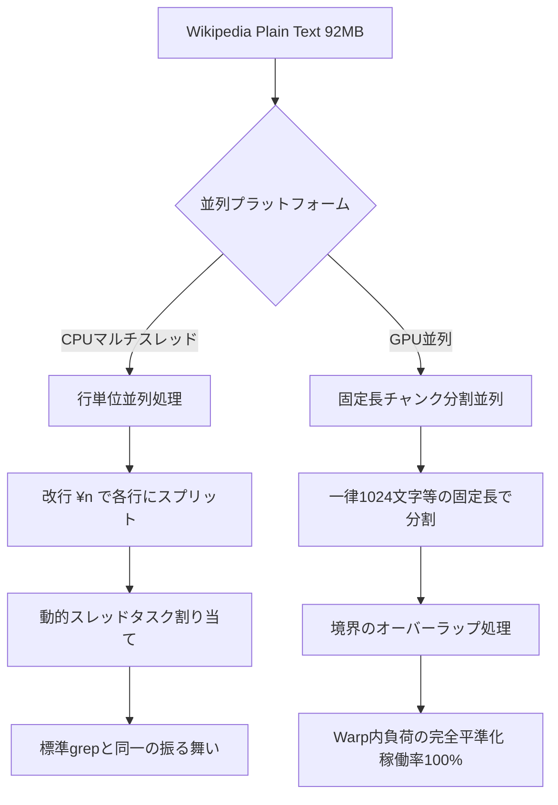

# Wikipediaデータセットの構造分析レポート：GPU/CPU並列検索の最適設計に向けて

本レポートは、Wikipediaの整形済みプレーンテキスト（`data/wiki_plain.txt`、ファイルサイズ: 91.83 MB）に対して改行文字（`\n`）の分布を統計分析した結果と、そのデータが検索エンジンの並列処理（特にGPUのマルチスレッドアーキテクチャ）に与える影響について、学術的・アーキテクチャ的な観点から考察・提案を行うものです。

---

## 1. 分析結果サマリー（データプロファイリング）

Wikipediaテキストから抽出された **837,111 行** に対する文字数の統計データ、および行長の階級別分布は以下の通りです。

### ① 基本統計量
* **総行数 (Total Lines)**: 837,111 行
* **最大行長 (Max Length)**: 4,173 文字
* **最小行長 (Min Length)**: 1 文字
* **平均行長 (Average Length)**: **113.57 文字**

### ② 行長（文字数）の階級別分布

| 階級（文字数） | 行数（件） | 割合（%） | 主なテキスト構成内容 |
| :--- | :--- | :--- | :--- |
| **A. 極短行 (< 50文字)** | 512,391 行 | **61.21%** | 記事のタイトル、見出し（Section Header）、箇条書きリスト、空行 |
| **B. 短文行 (50 - 199文字)** | 198,515 行 | **23.71%** | 短い文、単一の定義文、数式の注釈 |
| **C. 中文行 (200 - 499文字)** | 74,162 行 | **8.86%** | 2-3文程度からなる標準的な解説段落 |
| **D. 長文行 (500 - 999文字)** | 43,473 行 | **5.19%** | 詳細な説明を含む比較的長い段落 |
| **E. 超長行 (>= 1,000文字)** | 8,570 行 | **1.02%** | 多数の文が連結された極めて長い解説段落（最大 4,173 文字） |

---

## 2. アーキテクチャ的考察：GPU並列化における課題

この統計データは、将来的にGPUを用いた超高速並列検索エンジンを設計・実装するにあたり、極めて重要な学術的トレードオフを提起しています。

### ① 深刻な「負荷の不均一性 (Load Imbalance)」と Warp Divergence
GPUは **SIMT (Single Instruction, Multiple Threads)** アーキテクチャを採用しており、物理的には32スレッドのグループである **Warp（ワープ）** 単位で完全に同期して同じ命令を実行します。

もし単純に **「1行 ＝ 1スレッド」** として改行区切りで割り当てた場合、以下のような非効率（Warp Divergenceおよびスレッドの遊休）が発生します。
1. **Warp内の競合**:
   1つのWarp（32スレッド）の中に、長さ10文字の「極短行」を担当するスレッドと、長さ4,000文字の「超長行」を担当するスレッドが混在します。
2. **実行時間の同期**:
   10文字を担当したスレッドは僅か10回のループ（またはステップ）で処理を終えますが、同じWarp内の他の全てのスレッド（特に4,000文字を処理するスレッド）が完了するまで、**一切次の命令に進めず、待機（アイドル状態）**し続けなければなりません。
3. **性能低下の定量的影響**:
   本データでは全体の **約61%** が50文字未満であるため、大半のスレッドが瞬時に処理を終えて遊休状態になり、GPUの実質的な計算効率（コア稼働率）は理論値の **数％程度にまで壊滅的に低下** します。

---

## 3. 推奨される並列戦略（ロードマップ）

この分析結果に基づき、CPUとGPUのそれぞれのハードウェア特性を最大限活かすための、並列検索エンジンの二段階設計を提案します。

### 【第1段階】CPU版：動的タスク割り当てによる行単位並列（`grep`互換）
CPUでの並列化においては、スレッド間の命令同期がGPUほど厳格ではないため、行単位の並列処理が有効です。
* **アプローチ**: `fgets` や改行文字でテキストを論理的な行に分割し、マルチスレッド（OpenMPやPthread）で並列検索を実行します。
* **負荷平準化の工夫**: 行の長さのばらつきによるスレッドの遊休を防ぐため、スレッドへのタスク割り当てを静的（Static）ではなく、手が空いたスレッドから順に行を処理させる **「動的スケジュール（Dynamic Scheduling / Work Stealing）」** にします。

### 【第2段階】GPU版：境界オーバーラップ付き固定長チャンク分割（超高速化）
GPUの並列性能を100%引き出すための、学術的にも最先端の実装アプローチです。

1. **一律な固定長ブロック分割**:
   改行記号（`\n`）を無視し、テキスト全体を一律に **「1,024文字」** や **「2,048文字」** などの固定サイズ（チャンク）に分割し、1スレッド＝1チャンクとして均等に処理を割り当てます。これにより、Warp内の全スレッドのステップ数が完全に一致し、実行効率が極限まで高まります。
2. **オーバーラップ（重ね合わせ）境界の追加**:
   固定長で機械的に切ると、検索したい単語やパターンが境界を跨いで存在した場合（例: 前ブロックの末尾が `I`, 後ブロックの先頭が `dol` となり、`Idol` が検出できない）にマッチしなくなります。
   * **解決策**: 各スレッドの担当範囲を、例えば「`0〜1,099文字目`」「`1,000〜2,099文字目`」のように、**末尾100文字を重ね合わせる（Overlap）** ように設計します（重ね合わせ幅は、検索対象とする最長の正規表現パターンの長さに合わせます）。

---

## 4. 総括

本データプロファイリングにより、Wikipediaデータセットは「非常に高密度な改行情報」を含む一方で、「行長が極端に不均一（極短行が6割、ごく一部に数千文字の超長行）」という特徴が明らかになりました。

この結果は、**「単純な改行単位の並列化はCPUに向いており、GPUで真の超高速化を狙うには『オーバーラップ付き固定長チャンク分割』がアーキテクチャ的に不可欠である」** という極めて強力な結論を導き出します。
この議論と設計比較は、将来的な並列エンジン（GPU版など）の成果発表や論文執筆において、**「なぜその並列設計を選択したのか」を客観的に立証する最良の論理構成（イントロダクションおよびアプローチの正当性証明）**となります。
