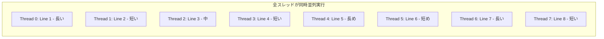
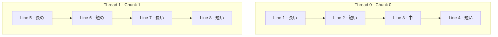
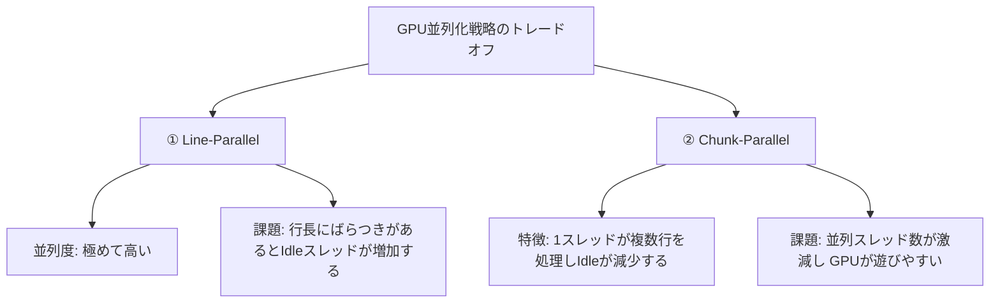

# GPU 並列化戦略（Line-Parallel vs Chunk-Parallel）の比較

本プロジェクトで比較している2つのGPU並列化戦略（Line-Parallel と Chunk-Parallel）の仕組みと違いについて、一般的なMermaid記法（互換性の高いフローチャート）を用いて図示し説明します。

時間計測方法の詳細については [time_measurement.md](file:///home/ubuntu/regular-expression-using-kagayaki/docs/time_measurement.md) を参照してください。

---

## 1. 対象テキスト（例: 8行、長さがバラバラ）

処理対象とするテキストデータが以下のような行構成（行数が多く、各行の長さが不揃い）であると仮定します。

```
Line 1 │████████████████████████████████████████│ "Wikipedia is a free online encyclopedia..."（長い）
Line 2 │███████│                                  "Hello world"（短い）
Line 3 │██████████████████│                       "The quick brown fox jumps over"（中）
Line 4 │██│                                       "Ok"（とても短い）
Line 5 │█████████████████████████│                "Natural language processing..."（長め）
Line 6 │█████████│                                "GPU acceleration"（短め）
Line 7 │████████████████████████████████│         "Regular expressions are powerful..."（長い）
Line 8 │██████│                                   "Done!"（短い）
```

---

## 2. 戦略 ①: Line-Parallel（1スレッド ＝ 1行）

各行に対して1つのCUDAスレッドを割り当てます。スレッド数は行数と等しくなります。

### スレッドの割り当てイメージ
すべてのスレッドが同時に立ち上がり、並列に処理が走ります。



### 時間軸で見た実行タイムライン

> 各 section がスレッドに対応。**色付きバー**が処理中、**グレーバー**が Idle を示す。

```mermaid
%%{init: {'theme': 'base', 'themeVariables': {'taskBkgColor': '#4a7fa5', 'taskBorderColor': '#2c5f7a', 'taskTextColor': '#ffffff', 'doneTaskBkgColor': '#b0bec5', 'doneTaskBorderColor': '#78909c', 'doneTaskTextColor': '#37474f'}}}%%
gantt
    title Line-Parallel タイムライン（単位: 相対時間）
    dateFormat  X
    axisFormat  %s

    section Thread 0
    Line 1 処理中     : 0, 40

    section Thread 1
    Line 2 処理      : 0, 7
    Idle             :done,   7, 40

    section Thread 2
    Line 3 処理      : 0, 18
    Idle             :done,   18, 40

    section Thread 3
    Line 4 処理      : 0, 2
    Idle             :done,   2, 40

    section Thread 4
    Line 5 処理      : 0, 25
    Idle             :done,   25, 40

    section Thread 5
    Line 6 処理      : 0, 9
    Idle             :done,   9, 40

    section Thread 6
    Line 7 処理中     : 0, 32
    Idle              :done,   32, 40

    section Thread 7
    Line 8 処理      : 0, 6
    Idle             :done,   6, 40
```



> **補足**: すべてのスレッドが時刻 0 に同時スタートするが、最も長い Thread 0（Line 1）が完了するまで cudaDeviceSynchronize() により全体の同期が取れない。

* **メリット**: 並列度が最大（スレッド数 ＝ 行数）になり、GPUのコアを最も飽和させやすい。
* **デメリット**: 短い行を担当したスレッドが早く終わり、長い行の処理を待つため、多くのスレッドが **Idle（無駄な待機状態）** になる。

---

## 3. 戦略 ②: Chunk-Parallel（1スレッド ＝ 複数行 / 例: LPC=4）

1つのスレッドに `LINES_PER_CHUNK`（LPC）行を割り当て、スレッド内はループで順次処理します。

### スレッドの割り当てイメージ
Thread 0 と Thread 1 が並列に動きますが、各スレッドの内部処理（Lineの処理）は上から順に直列実行されます。



### 時間軸で見た実行タイムライン

> 各スレッドが複数行を**順番に（直列に）**処理しているため、各バーが連続して並ぶ。

```mermaid
%%{init: {'theme': 'base', 'themeVariables': {'taskBkgColor': '#4a7fa5', 'taskBorderColor': '#2c5f7a', 'taskTextColor': '#ffffff', 'doneTaskBkgColor': '#b0bec5', 'doneTaskBorderColor': '#78909c', 'doneTaskTextColor': '#37474f'}}}%%
gantt
    title Chunk-Parallel タイムライン（LPC=4、単位: 相対時間）
    dateFormat  X
    axisFormat  %s

    section Thread 0
    Line 1 処理      : 0,  40
    Line 2 処理      : 40, 47
    Line 3 処理      : 47, 65
    Line 4 処理      : 65, 67

    section Thread 1
    Line 5 処理      : 0,  25
    Line 6 処理      : 25, 34
    Line 7 処理      : 34, 66
    Line 8 処理      : 66, 72
```



> **補足**: スレッドは 2 本しか起動せず、GPU の残りのコアは全く使われない。各スレッド内では行が直列に処理されるため、1 スレッドの占有時間が Line-Parallel と比べて大幅に長くなる。

* **メリット**: スレッドあたりで複数行の長さが平均化され、スレッド間の処理時間の偏り（不均衡）や Idle が減少する。
* **デメリット**: 起動するスレッド数が `行数 / LPC` に減少するため、GPUの並列性を活かしきれなくなる（GPUが暇になる）。

---

## 4. トレードオフのまとめ



### 本実験（Wikipediaデータ）における挙動の解釈
Wikipediaデータセットは**「行数が多く（約83万行）、各行が短い（〜99バイト）」**ため、
* **Line-Parallel** は83万スレッドという圧倒的な並列度によりGPUを完全に使い切るため非常に高速。
* **Chunk-Parallel** では、例えば LPC=8 の場合、スレッド数が1/8（約10万）に減少してしまい、GPUの処理能力を活かしきれなくなって低速化します。
