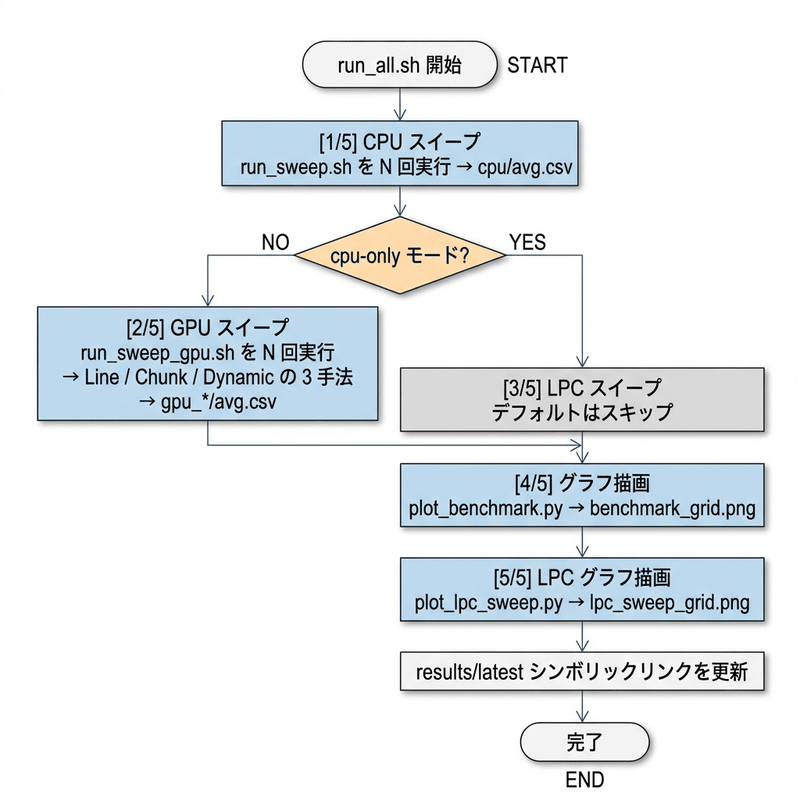
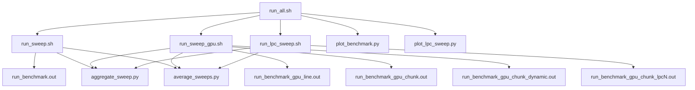

# run_all.sh 実行ガイド

`run_all.sh` はこのプロジェクトの**統合ベンチマーク実行スクリプト**です。  
CPU および GPU（3種の並列化戦略）に対してスイープ実験を複数回実施し、平均値を算出してグラフを自動生成します。

---

## 1. 実行コマンドと主なオプション

```bash
# 基本実行（CPU + GPU × 3手法, 各3回）
./run_all.sh

# オプション指定例
./run_all.sh --runs 5                    # 各ベンチマークを5回繰り返す
./run_all.sh --cpu-only                  # CPU のみ実行（GPU はスキップ）
./run_all.sh ./data/wiki_plain.txt       # 入力テキストを明示指定
```

| オプション | デフォルト | 説明 |
|---|---|---|
| `--runs N` | `3` | 各スイープの繰り返し回数 |
| `--cpu-only` | 無効 | GPU 計測をスキップして CPU のみ実行 |
| 第1引数（パス） | `./data/wiki_plain.txt` | ベンチマーク対象テキストファイル |

> **前提**: 実行前に `./setup_dataset.sh` でデータセットを準備し、`./env/vm_hosting_sh/start_container.sh` で Docker コンテナ内に入っておく必要があります。

---

## 2. 実行フロー（全体）




---

## 3. ステップ詳細

### [1/5] CPU スイープ

[run_sweep.sh](../run_sweep.sh) を `--runs` で指定した回数だけ繰り返します。

各回で行うこと:
1. CPU 版バイナリ（`run_benchmark.out`）を `-O3` でコンパイル
2. テキストサイズを `100 → 1,000 → 10,000 → ... → 最大文字数`（10 倍刻み）で変えながらベンチマーク実行
3. 各サイズの結果 CSV を `cpu/runN/result_sizeXXX.csv` に保存
4. `aggregate_sweep.py` で 1 回分の `summary.csv` を生成

全回終了後、`average_sweeps.py` で N 回分を平均して `cpu/avg.csv` を出力します。

### [2/5] GPU スイープ

[run_sweep_gpu.sh](../run_sweep_gpu.sh) を N 回繰り返します。1 回の実行で以下の **3 つの GPU 並列化手法**を同時にスイープします:

| バイナリ | マクロフラグ | 戦略 |
|---|---|---|
| `run_benchmark_gpu_line.out` | `GPU_LINE_RUN` | Line-Parallel（1スレッド = 1行） |
| `run_benchmark_gpu_chunk.out` | `GPU_CHUNK_RUN` | Chunk-Parallel Static（1スレッド = LPC行） |
| `run_benchmark_gpu_chunk_dynamic.out` | `GPU_CHUNK_DYNAMIC_RUN` | Chunk-Parallel Dynamic |

各手法の並列化戦略の詳細は [gpu_parallelism.md](gpu_parallelism.md) を参照してください。

### [3/5] LPC スイープ（デフォルトはスキップ）

`LINES_PER_CHUNK`（LPC）の値を変えながら Chunk-Parallel の性能を比較するスイープです。  
デフォルトでは `SKIP_LPC=1` のためスキップされます。有効化するには `run_all.sh` の変数を変更するか、`run_lpc_sweep.sh` を直接実行してください。

### [4/5] グラフ描画

`scripts/plot_benchmark.py` が以下の CSV を読み込み、グラフを生成します:

- `cpu/avg.csv`
- `gpu_line/avg.csv`（GPU 実行時のみ）
- `gpu_chunk/avg.csv`（GPU 実行時のみ）
- `gpu_chunk_dynamic/avg.csv`（GPU 実行時のみ）

出力: `plots/benchmark_grid.png`（全パターンのグリッド図）

### [5/5] LPC グラフ描画

LPC スイープを実行した場合のみ、`scripts/plot_lpc_sweep.py` が LPC 値ごとの比較グラフを生成します。

出力: `plots/lpc_sweep_grid.png`

---

## 4. 出力ディレクトリ構造

```
results/
└── run_<timestamp>/         ← 今回の実行結果
    ├── cpu/
    │   ├── run1/
    │   │   └── summary.csv  ← 1回目の全サイズ結果
    │   ├── run2/
    │   ├── run3/
    │   └── avg.csv          ← 3回の平均値
    ├── gpu/
    │   ├── run1/
    │   │   ├── gpu_line/
    │   │   │   └── summary.csv
    │   │   ├── gpu_chunk/
    │   │   │   └── summary.csv
    │   │   └── gpu_chunk_dynamic/
    │   │       └── summary.csv
    │   ├── run2/
    │   └── run3/
    ├── gpu_line/
    │   └── avg.csv          ← Line-Parallel 3回の平均値
    ├── gpu_chunk/
    │   └── avg.csv          ← Chunk-Parallel Static 3回の平均値
    ├── gpu_chunk_dynamic/
    │   └── avg.csv          ← Chunk-Parallel Dynamic 3回の平均値
    ├── lpc_sweep/           ← LPC スイープ実行時のみ生成
    │   ├── lpc_1/
    │   │   ├── run1/ ... run3/
    │   │   └── avg.csv
    │   ├── lpc_4/
    │   └── ...
    └── plots/
        ├── benchmark_grid.png    ← CPU vs GPU 比較グラフ
        └── lpc_sweep_grid.png    ← LPC 比較グラフ（LPC スイープ時のみ）

results/latest -> run_<timestamp>  ← 最新実行へのシンボリックリンク
```

---

## 5. 内部で呼び出されるスクリプト・ツール一覧



---

## 6. ベンチマーク対象の正規表現パターン

テストケースは `./data/test_cases.csv` で管理されています。現在のパターン（30種）:

| カテゴリ | パターン例 |
|---|---|
| 単純一致 | `the`, `Wikipedia`, `http` |
| 選択 | `cat\|dog`, `(The\|An\|In\|Of)` |
| 繰り返し | `a*b`, `go*gle`, `a+b*c` |
| 任意文字 | `.+ing`, `.+er`, `.+ly` |
| 複合 | `http.+wiki`, `(19\|20).+`, `(the\|a\|an) .+` |
| 選択の増加系列 | `(the)`, `(the\|and)`, ..., `(the\|and\|for\|are\|but\|not\|his\|has\|was\|can)` |

入力テキストのサイズは `100 → 1,000 → 10,000 → 100,000 → 1,000,000 → 10,000,000 → 最大（約9,590万文字）` の 7 段階でスイープされます。

---

## 7. 関連ドキュメント

- [dataset.md](dataset.md) — ベンチマーク対象データセット（enwik8）の詳細
- [gpu_parallelism.md](gpu_parallelism.md) — GPU 並列化戦略（Line-Parallel vs Chunk-Parallel）の比較
- [time_measurement.md](time_measurement.md) — 実行時間の計測方法
