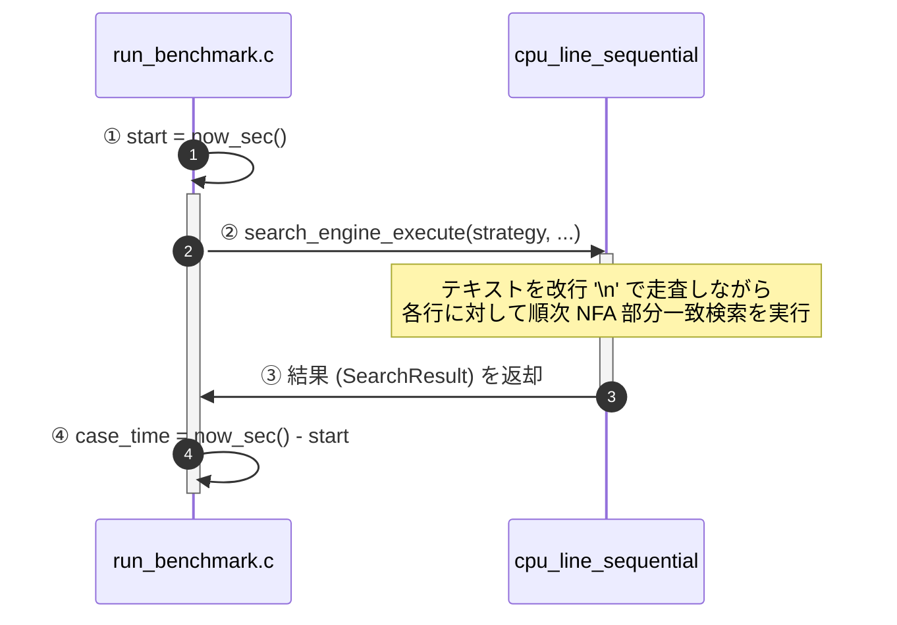
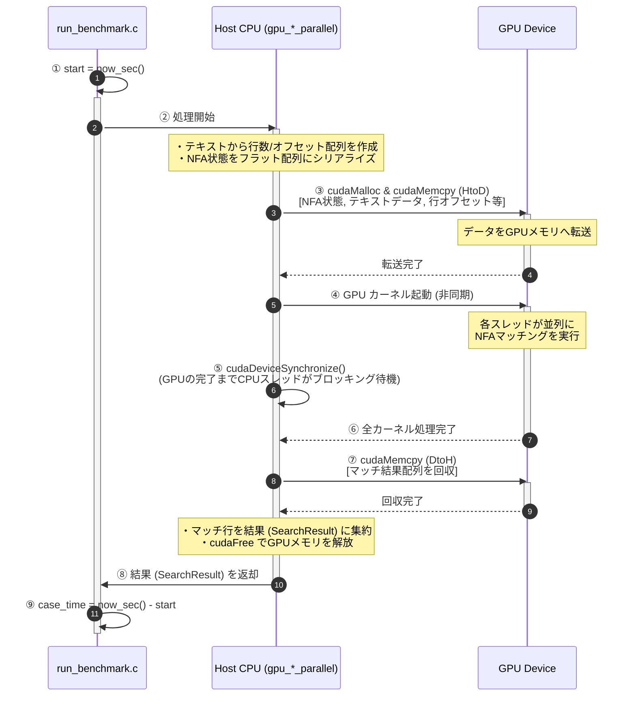

# 時間計測の測定方法とCPU・GPU版の測定差分

本プロジェクトのベンチマーク（`app/run_benchmark.c`）における、時間計測の実装詳細と、CPU版およびGPU版の測定範囲の差分について説明します。

GPU並列化戦略（Line-Parallel / Chunk-Parallel）の基本的な仕組みや違いについては、[gpu_parallelism.md](file:///home/ubuntu/regular-expression-using-kagayaki/docs/gpu_parallelism.md) を参照してください。

---

## 1. 時間計測の共通基盤（ナノ秒精度）

CPU/GPUのいずれの測定においても、時間を計測するAPIとして以下の `now_sec()` 関数を使用しています。

* **実装箇所**: [`src/common/utils.c`](file:///home/ubuntu/regular-expression-using-kagayaki/src/common/utils.c#L40-L45)
* **ロジック**: 
  C11標準ライブラリの `timespec_get` を用い、システムクロックからナノ秒精度の現在時刻（`TIME_UTC`）を取得し、`double` 型（秒単位の小数）に変換して返却します。
  ```c
  double now_sec(void) {
      struct timespec ts;
      timespec_get(&ts, TIME_UTC);
      return ts.tv_sec + ts.tv_nsec * 1e-9;
  }
  ```

---

## 2. 各処理の計測範囲とフローの可視化

### CPU版 (`cpu_line_sequential`)
CPU版はホスト上のシングルスレッドによるオンメモリ処理です。計測開始から終了まで、純粋にCPUでの文字列探索にかかる時間が測定されます。



---

### GPU版 (`gpu_line_parallel` / `gpu_chunk_parallel`)
GPU版では、GPUへのデータ転送、CUDAカーネルの実行、および同期処理が含まれます。
GPUカーネルは非同期に動作するため、カーネル起動直後にCPUへ制御が戻ります。そのため、測定の正当性を担保するために**ホスト側での明示的な同期化（`cudaDeviceSynchronize()`）を計測区間内に含めています**。

また、**「GPUへのデータ転送時間」や「GPUメモリの確保・解放」といったオーバーヘッドもすべて計測時間に含まれます。**



---

## 3. CPU版とGPU版の測定差分

時間計測区間に含まれる処理の違いを以下の表に示します。

| 処理ステップ | CPU版 (`cpu_line_sequential`) | GPU版 (Line/Chunk-Parallel) | 備考 |
| :--- | :---: | :---: | :--- |
| **NFAのメモリ構築** | **含まれる** | **含まれる** | CPU: ポインタ構造の構築 / GPU: シリアライズ |
| **テキスト構造解析** | **含まれる** | **含まれる** | 改行文字の検索と行配列の作成 |
| **GPUメモリ確保・解放** | N/A | **含まれる** | `cudaMalloc`, `cudaFree` のオーバーヘッド |
| **ホスト・デバイス間転送** | N/A | **含まれる** | `cudaMemcpy` (HtoD, DtoH) |
| **検索実行時間** | **含まれる** (CPU) | **含まれる** (GPU) | GPUは `cudaDeviceSynchronize` で同期 |
| **結果データの詰め込み** | **含まれる** | **含まれる** | `SearchResult` 構造体へのマッチ行の格納 |

> [!IMPORTANT]
> **GPU版の計測時間におけるデータ転送の扱い**
> 本ベンチマークでは、GPUカーネルの純粋な計算時間だけではなく、**GPUへのデータ送信および結果回収にかかる転送時間も含めた「トータルの時間」**を計測しています。
> 実用的なアプリケーションにおいて、GPUにテキストデータを置いて正規表現処理を呼び出す際には、この転送コストが必ず発生するため、このコストを含める測定方式は**「実用上の性能評価」として極めて正当**なものと言えます。

---

## 4. 実験の正当性の保証

1. **非同期実行のフライング防止**
   CUDAカーネルの実行は非同期ですが、計測区間内で `cudaDeviceSynchronize()` を呼び出しているため、すべてのGPUスレッドの処理が完全に完了するまで次のステップに進みません。これにより、「カーネル終了前に時間計測が終了してしまう」という問題を防いでいます。
2. **I/O処理（CSV書き出し・画面表示）の分離**
   コンソールへの出力や、CSVファイルへのディスク書き込み処理（`fflush`等）は、すべて時間計測が終了した**後**（`case_time` の計算後）に実行されます。したがって、ディスクI/Oの速度差がベンチマーク結果に悪影響を及ぼすことはありません。
