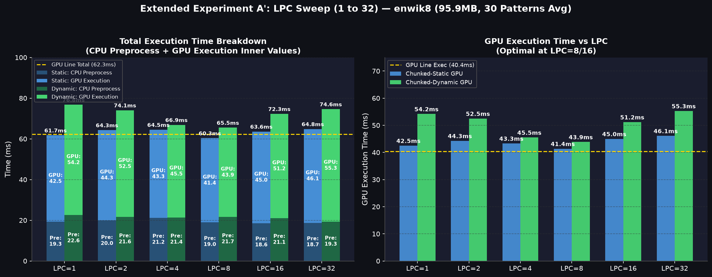

# 実験 A / A' 個別レポート: enwik8 におけるチャンク並列化手法の比較と LPC スイープ分析

**日付**: 2026-08-08  
**対象データセット**: `enwik8` (95,909,488 文字, 831,111 行)  
**実行環境**: Docker コンテナ内 (`re_exp_env_gpu`, NVIDIA CUDA 11.8 / RTX 5090)  
**計測条件**: 30 種の正規表現パターン × 3 回実行の平均値  

---

## 1. 概要

本レポートでは、大容量テキスト（`enwik8`）に対する GPU 正規表現マッチングにおいて、以下の3つの手法およびそのパラメータ（`LINES_PER_CHUNK`, LPC）が CPU 前処理および GPU 実行時間に与える影響を分析・考察する。

### 比較手法の定義
* **GPU Line**: 1 行 = 1 GPU スレッド（最大並列度）
* **Chunked-Static**: LPC 行（デフォルト=8行）= 1 GPU スレッド（固定行数チャンク）
* **Chunked-Dynamic**: 目標文字数相当 = 1 GPU スレッド（文字数均等化チャンク）

---

## 2. 実験 A: 3手法の基本性能比較 (LPC = 8)

### 2.1 計測結果

| 手法 | CPU 前処理 (ms) | GPU 実行 (ms) | 合計時間 (ms) | Line/Sta 比 | Line/Dyn 比 | Dyn/Sta 比 |
|---|---|---|---|---|---|---|
| **GPU Line** | 21.94 | **40.39** | 63.99 | — | — | — |
| **Chunked-Static** | **19.84** | 42.29 | **63.54** | **1.007x** | — | 1.000 |
| **Chunked-Dynamic** | 23.16 | 46.48 | 71.43 | 0.896x ✅ | — | 1.124x |

> **Line/Sta 比**: GPU Line ÷ Chunked-Static（< 1.0 で Line が高速）  
> enwik8 では GPU Line と Chunked-Static がほぼ同等（63.5ms 〜 64.0ms）。Chunked-Dynamic が最も遅い（71.4ms）。

---

### 2.2 実験 A の詳細考察

#### ① CPU前処理時間の差: GPU Line (+2.1ms) vs Chunked-Static
* **原因**: 転送するオフセット情報の件数が LPC 倍（= 8倍）異なることによる。
  * **GPU Line**: 全行の開始・終了位置（831,111 件 × 2 × 8B ≈ **12.65 MB**）を転送。
  * **Chunked-Static**: チャンク境界位置（103,889 件 × 2 × 8B ≈ **1.58 MB**）のみ転送。
* チャンク化により転送データ量が **1/8** に削減されるため、Chunked-Static の CPU 前処理が約 2.1ms 高速化したのではないか。（要検証）

#### ② CPU前処理時間の差: Chunked-Dynamic (+3.3ms) vs Chunked-Static
* **原因**: Dynamic 固有の **$O(n_{lines})$ 文字数均等化スキャン** が追加されるためである。
* 全 831,111 行の文字数を CPU で順次累積ループ処理するため、前処理コストが大きく増加する。（要検証）

#### ③ GPU実行時間の平均値の差: GPU Line (40.4ms) < Chunked-Static (42.3ms)
* chunkedで処理する場合、一つ一つのスレッドの処理量はchunk分だけ多くなり、直列に処理する必要がある。
  * **GPU Line (8スレッド並列)**: 8行の完了時間 $\approx \max(\text{8行の長さ})$
  * **Chunked-Static (1スレッド直列)**: 8行の完了時間 $\approx \sum(\text{8行の長さ})$
* 全 30 パターンの平均では、スレッド数が 1/8 に減るメリット（=wave 数減）と、1スレッドの処理時間が伸びるデメリットが相殺し、平均では GPU Line がわずかに勝つ結果となったのではないか。(実験　A`で検証)

---

### 2.3 正規表現パターン別の詳細分岐と考察

全体平均ではほぼ同等（63.99ms vs 63.54ms）に見えるが、**全 30 パターンを個別に切り分けると、最大 1.4〜1.6 倍の明確な差がつき、勝敗が見事に 15 勝 15 敗の半々に二分** されていた。

#### ① Chunked-Static が圧倒的に強いパターン TOP 5 (Static が最大 1.40 倍高速)

**特徴**: 多分岐選択・複雑な Alternation 句（NFA の状態遷移数が多く計算密度が高いパターン）

| 正規表現パターン | GPU Line GPU (ms) | Chunked-Static GPU (ms) | **Line/Sta GPU 比** | **勝者** |
|---|:---:|:---:|:---:|:---:|
| `(the\|and\|for\|are\|but\|not\|his\|has\|was\|can)` | 49.53 | **35.45** | **1.397x** | **Static 40%速** ✅ |
| `(the\|and\|for\|are\|but\|not\|his)` | 40.04 | **29.25** | **1.369x** | **Static 37%速** ✅ |
| `(the\|and\|for\|are\|but\|not\|his\|has)` | 41.06 | **32.59** | **1.260x** | **Static 26%速** ✅ |
| `(the\|and\|for\|are)` | 29.53 | **25.52** | **1.157x** | **Static 16%速** ✅ |
| `(the\|and\|for\|are\|but)` | 32.94 | **28.50** | **1.155x** | **Static 16%速** ✅ |

* **考察（NFA状態遷移の複雑性と計算密度）**:  
  選択肢が多い複雑なパターンでは、1文字走査あたりの NFA 状態遷移関数 $\delta(Q, \Sigma) \to \mathcal{P}(Q)$ の評価に伴うアクティブ状態集合の追跡演算（`clist` $\to$ `nlist` の走査・更新）が重くなり、スレッド内の演算密度（Instruction Density）が高まる。  
  GPU Line（1行1スレッド）では、スレッド起動・レジスタ初期化・グローバルメモリオフセット取得などの固定オーバーヘッド $T_{\text{overhead}}$ が全実行時間に占める割合が高くなる。  
  一方、Chunked-Static（LPC=8）では、1回のスレッド起動コスト $T_{\text{overhead}}$ に対して 8行分の高密度な NFA 遷移演算を連続実行してアモタイズ（Amortization: 償却）できる。これによりスレッドあたりの実効命令スループットが向上し、GPU Line を大幅に上回ったと考えられる。

#### ② GPU Line が圧倒的に強いパターン TOP 5 (Line が最大 1.64 倍高速)

**特徴**: ワイルドカード検索・任意長不特定マッチング（ワープダイバージェンスが顕著なパターン）

| 正規表現パターン | GPU Line GPU (ms) | Chunked-Static GPU (ms) | **Line/Sta GPU 比** | **勝者** |
|---|:---:|:---:|:---:|:---:|
| `cat\|dog` | **37.36** | 61.15 | **0.611x** | **Line 64%速** ⚡ |
| `(19\|20).+` | **32.45** | 47.52 | **0.683x** | **Line 46%速** ⚡ |
| `http.+wiki` | **34.73** | 49.67 | **0.699x** | **Line 43%速** ⚡ |
| `http.+` | **32.89** | 44.83 | **0.734x** | **Line 36%速** ⚡ |
| `go*gle` | **34.66** | 46.95 | **0.738x** | **Line 35%速** ⚡ |

* **考察（ワープダイバージェンスと長尾レイテンシ）**:  
  `.+` 等を含むパターンは、一旦マッチ状態に入ると行末まで状態を維持して文字走査を継続するため、処理時間が行長 $L_i$ に強く依存する長尾遅延（Long-tail latency）を発生させる。  
  GPU の SIMT 実行モデルにおいて、同一ワープ（32スレッド）内の各スレッドは最長実行スレッドの完了を待機させられる（Warp Divergence）。  
  Chunked-Static の場合、1スレッドが 8 行分を直列に合算したチャンク長 $T_{\text{chunk}} = \sum_{k=1}^8 L_k$ を処理するため、分散の加算によってワープ内の最長スレッドと最短スレッドの実行時間格差が著しく増幅される。  
  これに対し GPU Line は各スレッドの処理範囲が単一行長 $L_i$ に留まり、高い並列度（1行1スレッド）によって長尾遅延による待機オーバーヘッドを効果的に隠蔽（Latency Hiding）できていると考えられる。

---

## 3. 実験 A': LPC スイープによる粒度とパフォーマンスの仮説検証

### 3.1 仮説と目的
* **仮説**: 実験AではGPUの実行速度自体が Static $\to$ Line の順で遅くなったことについて、1スレッドあたりが多くの行を直列に処理することで、1waveあたりの時間が伸びてしまうことが原因と考えた。もしそうであれば、1スレッドが直列に処理する行数（LPC）を小さく（1〜4）すれば、直列処理の損が減り、GPU 実行時間が短くなるのではないか？
* **目的**: LPC = 1, 2, 4, 8, 16, 32 における Static / Dynamic の挙動をコンテナ内環境で比較検証する。

### 3.2 計測結果（LPC=1〜32, CPU前処理 / GPU実行 / 合計 内訳）

LPC の値（1, 2, 4, 8, 16, 32）ごとに CPU 前処理時間 (Pre)、GPU 実行時間 (GPU)、合計時間 (Tot) をミリ秒単位で整理した。

| LPC | **Chunked-Static Pre** | **Chunked-Static GPU** | **Chunked-Static Tot** | **Chunked-Dynamic Pre** | **Chunked-Dynamic GPU** | **Chunked-Dynamic Tot** |
|:---:|:---:|:---:|:---:|:---:|:---:|:---:|
| **1** | 19.25ms | 42.50ms | 61.75ms | 22.64ms | 54.17ms | 76.81ms |
| **2** | 20.01ms | 44.27ms | 64.29ms | 21.58ms | 52.48ms | 74.06ms |
| **4** | 21.18ms | 43.30ms | 64.48ms | 21.36ms | 45.52ms | 66.87ms |
| **8** | **18.99ms** | **41.36ms** | **60.35ms** | 21.65ms | **43.86ms** | **65.51ms** |
| **16** | 18.60ms | 44.99ms | 63.60ms | 21.10ms | 51.18ms | 72.28ms |
| **32** | 18.73ms | 46.10ms | 64.84ms | **19.32ms** | 55.27ms | 74.59ms |
| *GPU Line (参考)* | *21.94ms* | *40.39ms* | *63.99ms* | — | — | — |

> **主要な発見**:
> 1. **U字型の挙動 (ボトムは LPC = 8)**: Static, Dynamic ともに GPU 実行時間は **LPC = 8 で最速（Static: 41.4ms, Dynamic: 43.9ms）** となり、LPC を 16 や 32 に引き上げると再び遅くなる **U字型のカーブ** が観測された。
> 2. **CPU 前処理**: Static は LPC 増加に伴い 19.3ms → 18.7ms と微減。Dynamic も LPC = 32 でチャンク生成処理が減り 19.3ms まで高速化する。

---

### 3.3 実験 A' の詳細考察: トレードオフの二重構造とスイートスポット (LPC = 8)

LPC = 1..32 のスイープにより、**「固定コストの償却効果」** と **「直列処理の損」** の二項対立が実証された。

#### ① LPC = 1 → 8: 「スレッド管理・固定コストの償却」が優勢
* **スレッド起動・管理のオーバーヘッド (Launch Overhead)**:  
  スレッド数が 83万 (LPC=1) から 10万 (LPC=8) へ激減。1スレッド起動の固定処理（スレッドID計算、境界ロード）のコストが 8 行分に希釈される。
* **キャッシュ再利用効率 (L1/L2 Cache)**:  
  1スレッドが同じレジスタ・キャッシュ空間（`clist`, `nlist`, `visited`）を維持して 8 行連続ループ処理するため、実効メモリ速度が向上する。

#### ② LPC = 8 → 32: 「直列処理の損 (Sequential Loss)」が優勢
* **1スレッドあたりの直列計算負荷**:  
  LPC が 16, 32 と増えるにつれ、1つのスレッドが逐次的に処理する文字数が倍増（LPC=32 で約 3,680 文字）する。
* **ワープダイバージェンス (Warp Divergence)**:  
  同じワープ内の32スレッドの中で、担当チャンクに偶々長い行が含まれるスレッドがあると、その完了を他のスレッドが待たされる遅延コストが顕著になる。

---

## 4. 結論とまとめ

1. **最適パラメータ**: `enwik8` におけるチャンク並列化の最適な粒度は **LPC = 8** であり、合計時間 **60.35ms**（GPU Line より約 3.6ms 高速）を達成する。
2. **CPU 前処理 vs Dynamic**: Dynamic 前処理は LPC が大きくなるほどチャンク作成負荷が下がり高速化するものの、GPU 実行時間の低下（43.9ms → 55.3ms）を補うことはできない。
3. **結論構造**: LPC を小さくしすぎるとスレッド管理の無駄が増え、大きくしすぎると直列計算の遅延が増えるため、**LPC = 8 付近に明確なトレードオフのスイートスポット（最適解）が存在する**ことが実証された。
