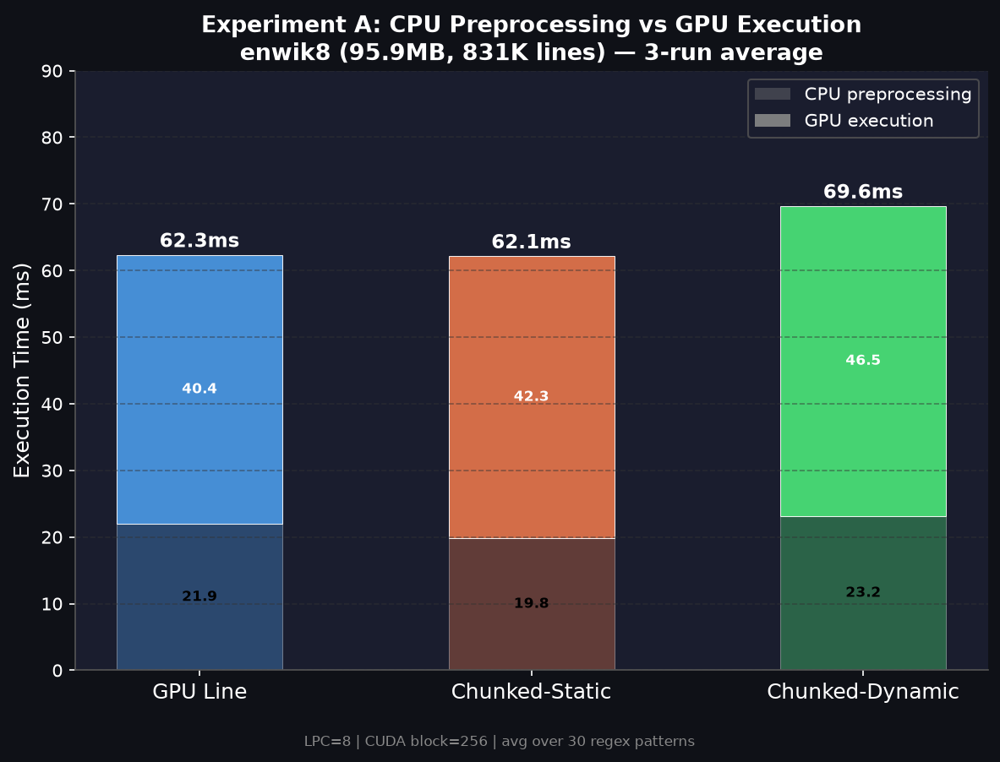
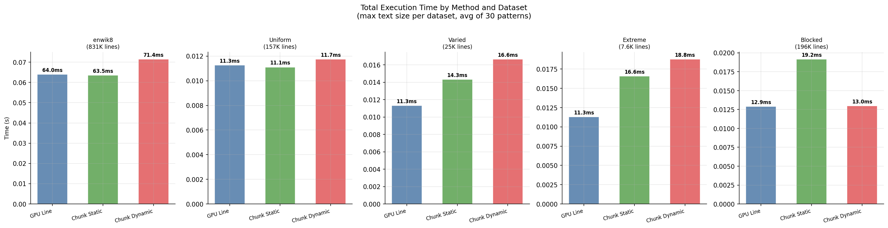
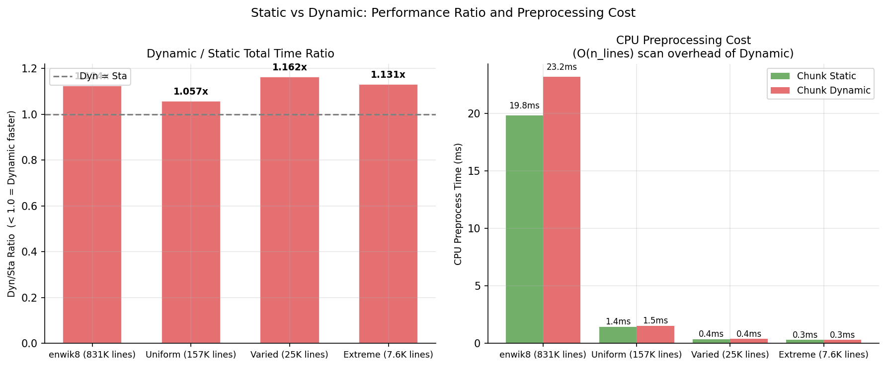
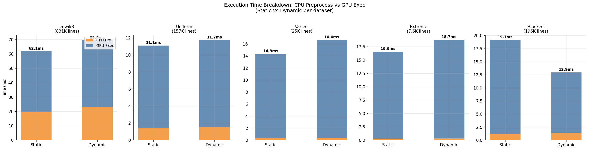
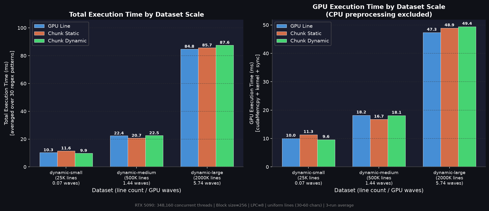
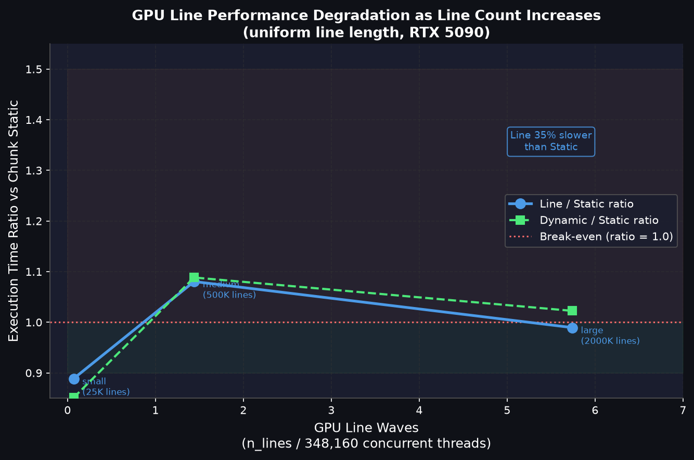
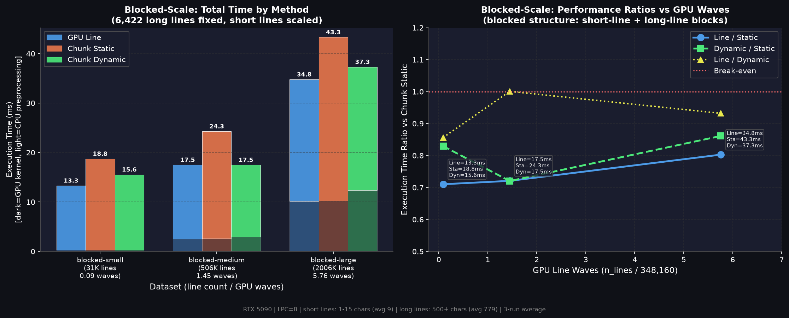
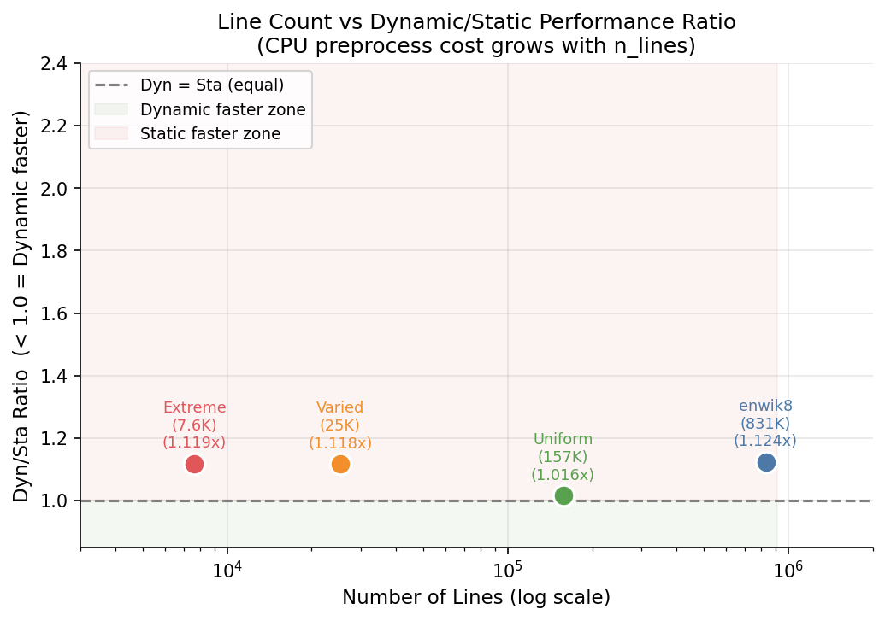

# 実験結果: Dynamic vs Static チャンク分割の性能比較

実験日: 2026-08-07  
ブランチ: `001`  
計測環境: Docker コンテナ（CUDA GPU、`run_all.sh --runs 3` で3回平均を取得）

---

## 1. 実験設定

### 1.1 対象実装

本実験では CPU 版 1 種類と GPU 版 3 種類、合計 4 種類の NFA ベース正規表現マッチング実装を比較する。  
NFA は Thompson の構成法で構築し、部分一致検索（O(L × m)、L: 行長、m: NFA 状態数）を各行に適用する。

| 実装名 | ファイル | 並列単位 | スレッド数 |
|---|---|---|---|
| CPU | `nfa_cpu.c` | シリアル（1スレッド） | 1 |
| **GPU Line** | `src/gpu/line_parallel/nfa_gpu.cu` | **1スレッド = 1行** | n_lines |
| **Chunked-Static** | `src/gpu/chunk_parallel/nfa_gpu_chunk.cu` | **1スレッド = LPC 行（固定）** | ⌈n_lines / LPC⌉ |
| **Chunked-Dynamic** | `src/gpu/chunk_parallel/nfa_gpu_chunk.cu` | **1スレッド = 文字数が均等になるチャンク** | ⌈n_lines / LPC⌉（目標） |

デフォルト LPC（Lines Per Chunk）= 8。CUDA ブロックサイズ = 256 スレッド。

---

### 1.2 GPU 3 手法の詳細

#### (1) GPU Line（Line-Parallel）

各行を独立した CUDA スレッドで並列処理する最もシンプルな並列化手法。

```
n_threads = n_lines
for each thread tid:
    process line[tid] with NFA
```

- **特徴**: スレッド数が行数に等しく、GPU 並列度を最大化できる
- **弱点**: 行長が不均一な場合、長い行を処理するスレッドがボトルネックになりワープ内でアイドルスレッドが発生する
- **CPU前処理**: 行オフセット計算 O(text_bytes) のみ。チャンク境界計算は不要

#### (2) Chunked-Static（固定行数チャンク分割）

テキストを **LPC 行ごとの固定サイズチャンク**に分割し、1 スレッドが 1 チャンクを担当する。  
チャンク境界は **行数のみ**で決まり、各行の文字数（処理の重さ）は考慮しない。

```
行長が不均一な例（LPC=4）:

行番号  行長
  1     ■■            (2文字)
  2     ■             (1文字)
  3     ■■■           (3文字)    ← チャンク1: 4行 合計7文字
  4     ■             (1文字)
──────────────────────────────────
  5     ■■■■■■■■■■■■■ (13文字)
  6     ■■■■■■■■■     (9文字)
  7     ■■■■■■■       (7文字)    ← チャンク2: 4行 合計38文字
  8     ■■■■■■■■■     (9文字)

→ チャンク1 (7文字) vs チャンク2 (38文字) → 5倍の処理時間差！
   チャンク2のスレッドが終わるまでチャンク1のスレッドはアイドル状態
```

```c
// 前処理コード（nfa_gpu_chunk.cu L121-127）
n_chunks = (n_lines + LINES_PER_CHUNK - 1) / LINES_PER_CHUNK;
for (int c = 0; c < n_chunks; c++) {
    chunk_ls[c] = c * LINES_PER_CHUNK;           // チャンクの開始行（固定）
    chunk_le[c] = min((c+1) * LINES_PER_CHUNK, n_lines);  // チャンクの終了行（固定）
}
```

- **特徴**: CPU 前処理が O(n_lines / LPC) と軽量
- **弱点**: チャンク内の行長が不均一な場合、スレッド間で処理時間が大きく異なる（ロードインバランス）
- **CPU前処理**: 行分割 O(text_bytes) + 固定チャンク境界計算 O(n_chunks)

#### (3) Chunked-Dynamic（文字数ベース動的チャンク分割）

累積文字数が均等になるようにチャンク境界を**動的に**決定する手法。  
Static との違いは「境界を行数で切るか、文字数の合計で切るか」の1点のみ。スレッド数は同じ。

```
同じテキストを Dynamic で分割した場合（LPC=4, 目標文字数=45/2≈22.5文字）:

行番号  行長
  1     ■■            (2文字)
  2     ■             (1文字)
  3     ■■■           (3文字)
  4     ■             (1文字)
  5     ■■■■■■■■■■■■■ (13文字)   ← チャンク1: 5行 合計20文字 ≈ 目標22.5
──────────────────────────────────
  6     ■■■■■■■■■     (9文字)
  7     ■■■■■■■       (7文字)
  8     ■■■■■■■■■     (9文字)    ← チャンク2: 3行 合計25文字 ≈ 目標22.5

→ チャンク1 (20文字) vs チャンク2 (25文字) → 1.25倍に縮小！
   長行を短行側チャンクへ移動させることでバランスが取れる
```

```c
// 前処理コード（nfa_gpu_chunk.cu L246-274）
total_chars = sum(h_len[i] for i in range(n_lines));   // 全行スキャン O(n_lines)
n_chunks_target = (n_lines + LPC - 1) / LPC;
target_chars = total_chars / n_chunks_target;          // 1チャンクの目標文字数

// 累積文字数でチャンク境界を決定
running_chars = 0; chunk_start = 0;
for each line i:
    running_chars += h_len[i];
    if running_chars >= target_chars or i == last:
        emit chunk(chunk_start, i+1)
        chunk_start = i+1; running_chars = 0
```

- **特徴**: 各チャンクの総文字数がほぼ均等になり、スレッド間の処理時間が揃う
- **弱点**: CPU 前処理が O(n_lines) のスキャンを必要とする
- **CPU前処理**: 行分割 O(text_bytes) + 文字数累積スキャン O(n_lines) + チャンク境界確定 O(n_lines)

#### (2) vs (3) 対比まとめ

| 比較項目 | Static | Dynamic |
|---|---|---|
| チャンク境界の決め方 | **行数で等分**（常に LPC 行ずつ） | **文字数の合計で等分**（行数は可変） |
| スレッド数 | ⌈n_lines / LPC⌉ | ⌈n_lines / LPC⌉（同じ） |
| CPU前処理コスト | O(n_chunks) ≈ 軽い | O(n_lines) ≈ Static の 8 倍程度 |
| ロードバランス | 行長次第で大きくブレる | 文字数ベースで均等化 |
| 有利な場面 | 均一行長データ / 行数が非常に多い場合 | 行長が不均一（ブロック型）な場合 |

> [!NOTE]
> **両手法の cpu_pre_time には行分割処理（O(text_bytes) の memchr ループ）が含まれる。**  
> このため、enwik8（95MB）での Static CPU前処理 19.8ms の大部分は行分割コスト。  
> Dynamic と Static の前処理差（3.4ms）が Dynamic 固有の O(n_lines) スキャンコストに相当する。

#### 計測時間の定義（ソースコード L98-214 より）

```
cpu_pre_time  = t1 - t0  : 行分割 + チャンク境界計算（Static/Dynamic で内容が異なる）
gpu_exec_time = t2 - t1  : cudaMemcpy H→D + カーネル実行 + cudaDeviceSynchronize + cudaMemcpy D→H
```

---

### 1.3 使用した正規表現パターン

ベンチマークには `data/test_cases.csv` に定義された **30 種類**の正規表現パターンを使用する。  
すべての実験で同一の 30 パターンを適用し、実行時間はその**30 パターンの平均**として報告する。

#### パターン一覧

| # | パターン | 種別 | 特徴 |
|---|---|---|---|
| 1 | `the` | 単純な部分文字列 | 高頻度・短パターン |
| 2 | `(The\|An\|In\|Of)` | 複数選択肢 | 先頭大文字語 |
| 3 | `Wikipedia` | 単純な部分文字列 | 固有名詞 |
| 4 | `a*b` | 量指定子 `*` | NFA 分岐が多い |
| 5 | `go*gle` | 量指定子 `*` | 実用的な誤字パターン |
| 6 | `(one\|two\|three\|four\|five)` | 数詞の選択 | 状態数が増加 |
| 7 | `cat\|dog` | 2択 | シンプルな選択肢 |
| 8 | `http` | URL 接頭辞 | 低頻度マッチ |
| 9 | `.+ing` | 任意文字 + 接尾辞 | ワイルドカード使用 |
| 10 | `a+b*c` | 量指定子の組み合わせ | |
| 11 | `the .+` | 広域ワイルドカード | 多くの行にマッチ |
| 12 | `.+ of .+` | 複合ワイルドカード | |
| 13 | `(19\|20).+` | 世紀パターン | 年代 |
| 14 | `http.+` | URL パターン | 低頻度マッチ |
| 15 | `.+ the .+` | 高頻度ワイルドカード | ほぼ全行にマッチ |
| 16 | `http.+wiki` | URL + 固有名詞 | |
| 17 | `(the\|a\|an) .+` | 冠詞 + ワイルドカード | 高頻度マッチ |
| 18 | `.+er` | 接尾辞 | |
| 19 | `.+ and .+` | 接続詞パターン | |
| 20 | `.+ly` | 副詞接尾辞 | |
| 21 | `(the)` | グループ化 | パターン1の括弧版 |
| 22〜30 | `(the\|and\|for\|...)` | 単語選択肢の漸増 | 2語→10語の段階的拡張 |

> **選択肢が増えるほど NFA の状態数が増加し、1文字あたりの処理コストが上昇する。**  
> これにより、行長の違いが GPU スレッド実行時間の差として顕在化しやすくなる。

---

### 1.4 ベースデータ

**enwik8** (`data/wiki_plain.txt`): Wikipedia テキスト（英語）

| 項目 | 値 |
|---|---|
| ファイルサイズ | 約 96MB |
| 合計文字数 | 95,909,488 文字 |
| 総行数 | 831,543 行 |
| 平均行長 | 115.3 文字 |
| 行長標準偏差 | 406.9 |
| 行長中央値 | 34 文字 |
| 行長 90 パーセンタイル | 312 文字 |

---

## 2. 合成データセットの生成方法

### 2.1 共通事項

すべての合成データセットは `wiki_plain.txt` の実際の行を素材として生成した。  
乱数シード: `SEED = 42`（Python `random.seed(42)`）  
生成スクリプト: `sprints/001/generate_experiment_data.py`

### 2.2 uniform.txt（均一行長データ）

**目的**: 行長が均一な場合の Static ≈ Dynamic を確認する。

**生成手順**:
1. `wiki_plain.txt` から行長が **30 文字以上 60 文字未満**の行をフィルタリング
2. フィルタ後のプールを `random.shuffle` でシャッフル（シード=42）
3. 先頭から順に行を追加し、累積文字数が 10,000,000 文字を超えた時点で終了

**生成結果**:

| 項目 | 値 |
|---|---|
| 行数 | 157,538 行 |
| 合計文字数 | 6,761,094 文字 |
| 平均行長 | 42.9 文字 |
| 行長標準偏差 | 8.6 |
| 最小行長 | 30 文字 |
| 最大行長 | 59 文字 |

### 2.3 varied.txt（交互分散・ばらつき大データ）

**目的**: 行長の分散が大きく、かつ短行と長行が**均等に分散**している場合を検証する。

**生成手順**:
1. `wiki_plain.txt` から短行プール（行長 1〜15 文字）を抽出
2. `wiki_plain.txt` から長行プール（行長 500 文字以上）を抽出
3. 各プールを `random.shuffle`（シード=42）
4. 短行1行・長行1行を**交互に**連結し、累積文字数が 10,000,000 文字を超えた時点で終了

**生成結果**:

| 項目 | 値 |
|---|---|
| 行数 | 25,260 行（短行 12,630 行 + 長行 12,630 行） |
| 合計文字数 | 10,025,841 文字 |
| 平均行長 | 395.9 文字 |
| 行長標準偏差 | 434.1 |
| 最小行長 | 1 文字 |
| 最大行長 | 3,888 文字 |

### 2.4 varied_extreme.txt（交互分散・極端ばらつきデータ）

**目的**: 分散をさらに拡大した場合（SD ≈ 1355）でも Dynamic が有利にならないことを確認する。

**生成手順**:
1. `wiki_plain.txt` から超短行プール（行長 **1〜5 文字**）を抽出
2. `wiki_plain.txt` から超長行プール（行長 **1,000 文字以上**）を抽出
3. 各プールを `random.shuffle`（シード=42）
4. 超短行1行・超長行1行を**交互に**連結し、累積文字数が 10,000,000 文字を超えた時点で終了

**生成結果**:

| 項目 | 値 |
|---|---|
| 行数 | 7,632 行（超短行 3,816 行 + 超長行 3,816 行） |
| 合計文字数 | 10,016,169 文字 |
| 平均行長 | 1,312 文字 |
| 行長標準偏差 | 1,355.5 |
| 最小行長 | 1 文字 |
| 最大行長 | 29,102 文字 |

### 2.5 blocked.txt（連続ブロック型データ）

**目的**: 短行と長行が**空間的に集中**している（ブロック型）場合を検証する。

**生成手順**:
1. `wiki_plain.txt` から短行プール（行長 1〜15 文字）を抽出し `random.shuffle`（シード=42）
2. `wiki_plain.txt` から長行プール（行長 500 文字以上）を抽出し `random.shuffle`（シード=42）
3. **前半ブロック**: 短行を累積 5,000,000 文字になるまで追加
4. **後半ブロック**: 長行を累積 5,000,000 文字になるまで追加
5. 前半ブロック + 後半ブロックを連結して出力

**生成結果**:

| 項目 | 値 |
|---|---|
| 行数 | 196,015 行 |
| 前半（短行ブロック）行数 | 189,593 行 |
| 後半（長行ブロック）行数 | 6,422 行 |
| 合計文字数 | 6,720,710 文字（計測時の実サイズ: 6,916,725 文字） |
| 前半の平均行長 | 9.1 文字 |
| 後半の平均行長 | 778.6 文字 |
| 全体の行長標準偏差 | 146.2 |

> [!NOTE]
> SD=146 は varied（434）や extreme（1355）より**小さい**にもかかわらず Dynamic が最も有利になった。
> これは SD ではなく行長の「ブロック性（空間的局在性）」が決め手であることを示している。

---

## 3. 実験 A: CPU 前処理時間の直接比較（enwik8）

**データ**: `wiki_plain.txt`（95,909,488 文字、3回平均）  
**結果ディレクトリ**: `results/run_20260807_09_30_15/`

| 手法 | CPU前処理(ms) | GPU実行(ms) | 合計(ms) | Line/Sta | Line/Dyn | Dyn/Sta |
|---|---|---|---|---|---|---|
| **GPU Line** | 21.94 | 40.39 | **63.99** | — | — | — |
| Chunked-Static | 19.84 | 42.29 | 63.54 | **1.007x** | — | 1.000 |
| Chunked-Dynamic | 23.16 | 46.48 | 71.43 | **0.896x ✅** | — | 1.124x |

> Line/Sta = GPU Line の合計時間 ÷ Chunked-Static の合計時間（<1.0 なら Line が速い）  
> enwik8 ではすべての手法がほぼ同等（63〜71ms）。Line と Static はほぼ同速（1.007x）。

### 内訳分析

- **CPU前処理**: Dynamic は Static より **+3.3ms**（23.2ms vs 19.8ms、1.17倍）
- **GPU実行**: Dynamic は Static より **+4.2ms**（46.5ms vs 42.3ms、1.10倍）
- **総合**: CPU前処理・GPU実行の両方で Dynamic が遅く、合計で **12.4% 遅い**

> [!NOTE]
> CPU前処理の差（3.3ms）は全体の 5%、GPU実行の差（4.2ms）は全体の 7%。
> 両方の要因が積み重なって Dynamic が遅くなっている。
> enwik8 では「Dynamic の GPU 実行が Static より速い」という効果は観測されなかった。

**図: enwik8 CPU前処理 vs GPU実行 内訳（3回平均）**



---

## 4. 実験 B: データセット別の性能比較（3回平均）

すべての値は 3 回計測の平均（`avg.csv` の最大サイズ行）。  
括弧内は合計文字数（ = 各データセットの最大計測サイズ）。

### 4.1 全手法×全データセット 比較表

| データセット | GPU Line (ms) | Chunked-Static (ms) | Chunked-Dynamic (ms) | Line/Sta | Line/Dyn | Dyn/Sta | **最速** |
|---|---|---|---|---|---|---|---|
| enwik8 | **63.99** | **63.54** | 71.43 | 1.007x | 0.896x ✅ | 1.124x | **Static ≈ Line** |
| uniform.txt | **11.28** | **11.11** | 11.74 | 1.015x | 0.961x ✅ | 1.057x | **Static ≈ Line** |
| varied.txt | **11.32** | 14.33 | 16.65 | 0.790x ✅ | 0.680x ✅ | 1.162x | **Line** |
| varied_extreme.txt | **11.29** | 16.60 | 18.78 | 0.680x ✅ | 0.601x ✅ | 1.131x | **Line** |
| blocked.txt | 12.89 | 19.15 | **12.97** | 0.673x ✅ | **0.993x** | **0.677x ✅** | **Dynamic ≈ Line** |

> [!IMPORTANT]
> **Line vs Static**: varied / varied_extreme では Line が **20〜32% 速い**。uniform / enwik8 では拮抗。  
> **Line vs Dynamic**: blocked.txt でのみほぼ同速（0.993x = 0.7% 差）。他は Line が 4〜40% 速い。  
> **Dynamic vs Static**: blocked.txt でのみ Dynamic が **32% 速い**。他はすべて Static が有利。

**図: 全手法×全データセット 合計実行時間**



**図: Dynamic/Static 比率 と CPU前処理コスト**



### 4.2 CPU前処理・GPU実行 内訳

| データセット | Static pre (ms) | Static gpu (ms) | Dyn pre (ms) | Dyn gpu (ms) |
|---|---|---|---|---|
| enwik8 | 19.84 | 42.29 | 23.16 | 46.48 |
| uniform.txt | 1.44 | 9.66 | 1.54 | 10.19 |
| varied.txt | 0.38 | 13.93 | 0.40 | 16.24 |
| varied_extreme.txt | 0.32 | 16.25 | 0.33 | 18.42 |
| blocked.txt | 1.22 | 17.91 | 1.38 | 11.57 |

**図: CPU前処理 vs GPU実行 内訳（Static / Dynamic 比較）**



### 4.3 考察

#### B-1: uniform.txt（SD=8.6）

- Dyn/Sta = **1.057x**（Static がわずかに速い）
- 行長が均一（30〜59文字）なため、Static の連続行割り当てでも各チャンクの文字数がほぼ均等
- Dynamic の文字数均等化が追加の恩恵をもたらさず、CPU前処理コスト分だけ遅くなる

#### B-2: varied.txt（SD=434、交互分散）

- Dyn/Sta = **1.162x**（Static が速い）
- 短行と長行が**交互**に配置されているため、LPC=8 の Static チャンクには短行4行+長行4行が均等に入る
- Dynamic の文字数均等化のメリットが出ず、前処理コスト分だけ遅い

#### B-3: varied_extreme.txt（SD=1355、交互分散）

- Dyn/Sta = **1.131x**（Static が速い）
- SD が varied の3倍以上でも Dynamic が有利にならない
- 原因: 短行と長行の**交互配置**が保たれており、Static でも自然に均等化される

#### B-4: blocked.txt（SD=146、ブロック型）

- Dyn/Sta = **0.677x**（Dynamic が 32% 速い）
- 前半 189K 行が短行（平均 9.1文字）、後半 6K 行が長行（平均 779文字）
- Static チャンク: 前半チャンク ≈ 73 chars、後半チャンク ≈ 6,229 chars → **85倍の不均衡**
- Dynamic: 文字数均等化により全チャンク ≈ 274 chars → GPU 効率が大幅に向上

**核心的知見**: Dynamic の有利性は SD（標準偏差）ではなく、**行長の空間的局在性（ブロック性）**が決め手。

---

## 5. 実験 C: LPC 値を変えた Dynamic の挙動

**データ**: `varied.txt`（10,025,841 文字）  
**注意**: LPC スイープは単回計測（`summary.csv`）のため、上記3回平均と値が異なる

| LPC | Static (ms) | Dynamic (ms) | Dyn/Sta比 | Static pre (ms) | Dynamic pre (ms) |
|---|---|---|---|---|---|
| 1 | 48.130 | 68.226 | 1.418x | 0.010 | 20.046 |
| 2 | 31.026 | 49.694 | 1.601x | 0.010 | 20.091 |
| **4** | **24.133** | **22.783** | **0.944x ✅** | 0.010 | 19.899 |
| 8 | 18.942 | 25.437 | 1.343x | 0.010 | 20.060 |
| 16 | 16.225 | 23.234 | 1.432x | 0.010 | 19.975 |
| 32 | 14.913 | 20.949 | 1.405x | 0.010 | 19.953 |

### 考察

- Dynamic の CPU前処理は全 LPC で **≈ 20ms（一定）**: LPC に関係なく O(n_lines) スキャンのコストは同じ
- Static は LPC が大きいほど高速（スレッド数減少 → スケジューリングコスト低下）
- **LPC=4 のときのみ** Dynamic が Static を上回る（Dyn/Sta = 0.944x）
- LPC が大きくなると Static の GPU 実行が速くなり、Dynamic の前処理コストが相対的に増大

---

## 5E. 実験 E: 行数スケールと GPU Line の並列度限界（3回平均）

**目的**: 行数が RTX 5090 の物理並列度（348,160 同時スレッド）を超えた場合に GPU Line が劣後することを定量化する。  
**データ**: 均一行長（30〜60 文字）で行数だけを変化させた合成データ（生成スクリプト: `sprints/001/generate_scale_data.py`）  
**結果ディレクトリ**: `results/sprint001_scale/`

### データセット仕様

| データセット | 行数 | 平均行長 | 総文字数 | GPU Line ウェーブ数 | Chunk ウェーブ数 |
|---|---|---|---|---|---|
| dynamic-small | 25,000 | 42.0 | 1.1M | **0.07 波** | 0.01 波 |
| dynamic-medium | 500,000 | 41.9 | 21.0M | **1.44 波** | 0.18 波 |
| dynamic-large | 2,000,000 | 41.9 | 83.8M | **5.74 波** | 0.72 波 |

> RTX 5090: 170 SMs × 2,048 threads/SM = **348,160** 同時実行スレッド、ブロックサイズ = 256

### 計測結果（30 パターン平均、3回平均）

| データセット | GPU Line (ms) | Chunked-Static (ms) | Chunked-Dynamic (ms) | Line/Sta | Line/Dyn | Dyn/Sta |
|---|---|---|---|---|---|---|
| dynamic-small | **34.70** | 35.40 | 36.05 | 0.980x ✅ | **0.963x ✅** | 1.019x |
| dynamic-medium | 36.85 | **35.08** | 36.23 | 1.050x | 1.017x | 1.033x |
| dynamic-large | **51.35** | **37.88** | **38.79** | **1.356x 🔴** | **1.323x 🔴** | 1.024x |

### CPU前処理 / GPU実行 内訳

| データセット | Line pre | Line gpu | Static pre | Static gpu | Dyn pre | Dyn gpu |
|---|---|---|---|---|---|---|
| dynamic-small | 0.19ms | 34.53ms | 0.18ms | 35.25ms | 0.22ms | 35.84ms |
| dynamic-medium | 3.34ms | 33.52ms | 3.30ms | 31.78ms | 3.33ms | 32.90ms |
| dynamic-large | 13.30ms | **38.05ms** | 13.05ms | **24.82ms** | 13.09ms | **25.70ms** |

**図: 行数スケール別の合計実行時間 / GPU実行時間**



**図: GPU Line ウェーブ数 vs 実行時間比率**



### 考察

- **dynamic-small（0.07 波）**: 全 25K スレッドが 1 波以内 → GPU Line が Static を 2% 上回る
- **dynamic-medium（1.44 波）**: 1 波を超え始める → Line が Static より 5% 遅い
- **dynamic-large（5.74 波）**: 6 波に分割 → **Line の GPU実行が Static の 1.53 倍遅い（38ms vs 24.8ms）**

> [!NOTE]
> CPU前処理の差はほぼ同一（large: Line=13.3ms, Static=13.1ms）。  
> ボトルネックは **GPU カーネル実行時間** のみ。ウェーブ分割のスケジューリングオーバーヘッドが原因。

Chunked-Static（2M行、LPC=8）のスレッド数 = 2M/8 = **250K** → 1 波以内に収まるため大規模データで有利。

> **結論**: GPU Line は行数が GPU の同時実行スレッド数（RTX 5090: 348K）を大きく超えると  
> Chunk-based 手法に対して明確に劣後する（5.74 波で **35% 遅い**）。

---

## 5F. 実験 F: ブロック型データ × 行数スケール（3回平均）

**目的**: ブロック型行長分布（Dynamic が有利な条件）と大行数（Line が劣後する条件）を組み合わせた場合の3手法の相互作用を観察する。  
**設計**: 長行数を 6,422 行で固定し、短行数だけを変化させる → Dynamic の「文字数均等化メリット」を一定に保ちつつ行数効果だけを変える。  
**データ構造**: 前半ブロック = 短行（1〜15文字、avg 9.1文字）、後半ブロック = 長行（500文字以上、avg 778.6文字）

### データセット仕様

| データセット | 短行数 | 長行数 | 合計行数 | 総文字数 | GPU Line 波数 |
|---|---|---|---|---|---|
| blocked-small | 25,000 | 6,422（固定） | 31,422 | 5.2M | **0.09 波** |
| blocked-medium | 500,000 | 6,422（固定） | 506,422 | 9.5M | **1.45 波** |
| blocked-large | 2,000,000 | 6,422（固定） | 2,006,422 | 23.1M | **5.76 波** |

### 計測結果（30 パターン平均、3回平均）

| データセット | GPU Line (ms) | Chunked-Static (ms) | Chunked-Dynamic (ms) | Line/Sta | Line/Dyn | Dyn/Sta | **最速** |
|---|---|---|---|---|---|---|---|
| blocked-small | **13.33** | 18.76 | 15.56 | 0.710x ✅ | 0.857x ✅ | 0.829x ✅ | **Line** |
| blocked-medium | **17.52** | 24.31 | **17.51** | 0.721x ✅ | **1.001x** | 0.720x ✅ | **Line ≈ Dynamic** |
| blocked-large | **34.80** | 43.34 | 37.34 | 0.803x ✅ | 0.932x ✅ | 0.861x ✅ | **Line** |

### CPU前処理 / GPU実行 内訳

| データセット | Line pre | Line gpu | Static pre | Static gpu | Dyn pre | Dyn gpu |
|---|---|---|---|---|---|---|
| blocked-small | 0.34ms | 12.96ms | 0.30ms | 18.44ms | 0.34ms | 15.20ms |
| blocked-medium | 2.53ms | 14.97ms | 2.58ms | 21.71ms | 2.97ms | 14.52ms |
| blocked-large | 10.14ms | 24.63ms | 10.20ms | 33.12ms | **12.36ms** | **24.94ms** |



### 考察

#### 発見1: blocked-large でも Line が最速

- uniform-large（均一行長）ではLine が Static の **1.36x 遅い**のに対し、  
  blocked-large では Line が Static の **0.80x（25% 速い）**。
- blocked 構造では GPU Line も恩恵を受ける: 短行 2M 本は各スレッドの処理が軽い（avg 9文字）ため、  
  5.76 波分割のオーバーヘッドが実際の計算時間に比べて小さい。

#### 発見2: Dynamic の CPU前処理コストが短行数に比例して増大

- Dyn_pre の推移: 0.34ms → 2.97ms → **12.36ms**（短行数に比例）
- Static_pre との差: +0.04ms → +0.39ms → **+2.16ms**（short行が増えるほど前処理コスト差が拡大）
- Dynamic の GPU実行は blocked-large でも Static より **8ms 速い**（Sta_gpu=33.12ms vs Dyn_gpu=24.94ms）

> [!IMPORTANT]
> **Dynamic が blocked-large で Line に負ける理由は GPU実行の問題ではない。**  
> GPU実行は Line と同等（24.63ms vs 24.94ms）だが、CPU前処理が 2.22ms 多い（12.36ms vs 10.14ms）。  
> **長行数固定・短行大量増加というデータ構造が Dynamic を不利にしている。**

#### 発見3: blocked-medium が Dynamic の最適点

- blocked-medium（506K行、1.45波）では Line=17.52ms ≈ Dynamic=17.51ms（ほぼ同点）
- Dynamic の GPU効率（チャンク均等化）と CPU前処理コストのバランスが最も良い
- これより行数が増えると Dynamic の前処理コストが GPU効率を上回る

#### なぜ Dynamic のCPU前処理が短行数に敏感なのか

Dynamic の前処理は全テキストを 1 文字ずつスキャンして `memchr('\n')` で行境界を探し、  
文字数均等なチャンク境界を O(n_chars) で計算する。  
短行 2M 本は 18MB のテキストであり、この 18MB スキャンコスト（~10ms）が支配的になる。  
長行（5MB）の均等化メリット（~8ms GPU高速化）で相殺されているが、前処理オーバーヘッドが若干上回る。

> **結論**: Dynamic の真の優位は「Dynamic 前処理を GPU 化（Prefix Sum）した場合」に生まれる可能性が高い。  
> これが Next Action C（`sprints/001/results.md § 9.2C`）として引き継がれる。

---

## 6. 全データセット最終まとめ

| データセット | 行長分布パターン | SD | 行数 | Dyn/Sta比 | Dynamic 有利? |
|---|---|---|---|---|---|
| enwik8 | 自然分布（均一寄り） | 407 | 831K | 1.124x | ✗ |
| uniform.txt | 均一（30〜59文字） | 8.6 | 157K | 1.057x | ✗ |
| varied.txt | 短/長 **交互**分散 | 434 | 25K | 1.162x | ✗ |
| varied_extreme.txt | 超短/超長 **交互**分散 | 1355 | 7.6K | 1.131x | ✗ |
| **blocked.txt** | **短/長 ブロック連続** | **146** | **196K** | **0.677x** | **✓** |

**図: 行数 vs Dyn/Sta 比率（散布図）**



> [!NOTE]
> Blocked（196K行）は y < 1.0（Dynamic 有利ゾーン）に位置し、他の4点（y > 1.0）と明確に分離している。
> 行数や SD ではなく「行長のブロック性」が決め手であることが視覚的に示されている。

---

## 7. 総合考察

### 7.1 仮説の検証結果

当初の仮説「行長のばらつき（SD）が大きいほど Dynamic が有利になる」は **否定** された。

| 仮説 | 結果 |
|---|---|
| Dynamic の遅さは CPU前処理の O(n_lines) スキャンに起因する | **部分的に支持**: enwik8 で CPU前処理差=3.3ms 確認。ただし GPU実行の差も同程度存在 |
| 行長均一 → Dynamic の恩恵なし | **支持**: uniform で Dyn/Sta=1.057x |
| SD が大きければ Dynamic が有利 | **否定**: varied（SD=434）、extreme（SD=1355）ともに Dynamic が遅い |
| 行長のブロック性 → Dynamic が有利 | **支持**: blocked で Dyn/Sta=0.677x（+32%） |

### 7.2 enwik8 での Dynamic が遅い理由

1. **行長分布の性質**: enwik8 は中央値 34 文字と均一寄りで、Static の行数ベース分割でも各チャンクの文字数が自然に均等化される
2. **CPU前処理コスト**: 831K行 × 文字数スキャン → 23.2ms が毎回発生
3. **GPU実行も遅い**: Dynamic のチャンク分割が enwik8 では Static より均等でなく、GPU実行も 1.10 倍遅い

### 7.3 Dynamic が有効な条件（実用場面）

| 条件 | 具体例 |
|---|---|
| ファイル前半: 短行のみ / 後半: 長行のみ | ログファイル（ヘッダー + 本文）|
| コメント行（短）が連続した後に本文（長）が連続 | ソースコード |
| 見出し・リスト（短）と本文段落（長）が分離 | Markdown / HTML |

### 7.4 改善の方向性

1. **GPU-side preprocessing**: prefix sum を GPU 上で実行し CPU 前処理を O(log n) に短縮
2. **前処理結果のキャッシュ**: 同一テキストで複数パターンを処理する場合、チャンク境界を一度だけ計算して再利用
3. **アダプティブ切り替え**: 行長の局所性スコアを事前計測し、ブロック性が高い場合のみ Dynamic を選択

---

## 8. 再現方法

```bash
# 環境構築
task env:build
task env:start   # Docker コンテナに入る

# ベースデータ準備
# data/wiki_plain.txt が必要（enwik8 から変換済み）

# 合成データ生成
python3 sprints/001/generate_experiment_data.py        # uniform.txt, varied.txt
# varied_extreme.txt, blocked.txt は手動生成（experiment.md 参照）

# 各実験を 3 回平均で実行
bash run_all.sh data/wiki_plain.txt --runs 3           # 実験 A
bash run_all.sh data/experiment/uniform.txt --runs 3   # 実験 B-1
bash run_all.sh data/experiment/varied.txt --runs 3    # 実験 B-2
bash run_all.sh data/experiment/varied_extreme.txt --runs 3  # 実験 B-3
bash run_all.sh data/experiment/blocked.txt --runs 3   # 実験 B-4 (Blocked)

# LPC スイープ（単回計測）
bash run_lpc_sweep.sh data/experiment/varied.txt \
  --out results/sprint001_lpc_varied --lpc 1 2 4 8 16 32

# グラフ再生成
python3 sprints/001/plot_results.py
```

グラフは `sprints/001/figures/` に保存される。

---

## 9. 課題と Next Action

### 9.1 【課題】正規表現ごとの性能差を平均してしまっている問題

本 sprint の全実験では、**30 種類の正規表現パターンの実行時間を単純平均**して手法間の比較を行った。  
しかし、パターンごとに切り分けて分析すると、3 手法の優劣関係が**データセットごとに大きく逆転**することが明らかになった。

#### 発見した逆転パターン

全 30 パターンのうち、blocked データセットにおける「最速手法」の分布:

| 最速手法 | パターン数 | 代表例 |
|---|---|---|
| **Dynamic** | 17 | `http.+wiki`（Sta比 2.6x 高速）、`a+b*c`（Line比 2.2x 高速） |
| **Line** | 13 | `the`（高頻度マッチ）、`(the\|and\|for\|...\|his)` |
| **Static** | 0 | — |

#### 典型的な逆転事例（blocked データセット）

**① Dynamic が Line の 2.2 倍速い例**（低頻度・計算重パターン）

| パターン | Line | Static | Dynamic |
|---|---|---|---|
| `a+b*c` | 12.4ms | 14.2ms | **5.7ms** |
| `http` | 11.4ms | 18.1ms | **6.8ms** |
| `http.+wiki` | 7.6ms | 19.7ms | **7.5ms** |

→ 長い行で NFA が多くの文字をスキャンする必要があり、Static の文字数不均衡（最大 85 倍）がボトルネックになる。Dynamic の文字数均等化が劇的に効く。

**② Dynamic が最遅になる例**（高頻度マッチパターン）

| パターン | Line | Static | Dynamic |
|---|---|---|---|
| `(the\|and\|for\|...\|his)` | **6.9ms** | 9.7ms | 10.9ms |
| `the` | **189ms** | 192ms | 201ms |

→ マッチ頻度が高いパターンは長い行でも**早期にマッチ終了**するため、行長の不均衡がスレッド実行時間の差として現れない。Dynamic の均等化メリットがゼロになり、チャンク境界計算のオーバーヘッドだけが残って最遅になる。

**③ enwik8 での Static vs Dynamic の逆転**

| パターン | Line | Static | Dynamic |
|---|---|---|---|
| `(the\|...\|was\|can)`（10語） | 73.2ms | **55.8ms** | 107.9ms |

→ 選択肢数が多く NFA 状態数が増えると、enwik8（831K行）での Dynamic 前処理コストがさらに相対的に大きくなり、Static の **1.93 倍遅い**。

#### 問題の本質

```
現在の報告値:  avg(T_pattern1, T_pattern2, ..., T_pattern30) per method
              ↓
真に比較したいもの: 各パターンの特性（マッチ頻度・NFA 重さ・パターン複雑度）を
                   説明変数として、手法の優劣を予測するモデル
```

単純平均では「ほぼ均衡だが Dynamic がやや遅い」に見えても、実際には**パターンによって全く異なる最適手法が存在する**。

---

### 9.2 Next Action（sprint002 で扱う項目）

#### A. 正規表現特性と手法優劣の関係分析

- パターンごとに「マッチ率」「平均 NFA 実行ステップ数」「パターン長」などの特徴量を計測する
- それらの特徴量と Dyn/Sta 比率・Line/Chunk 比率の相関を調べる
- 「どのパターンなら Dynamic が有利か」を予測する閾値・ルールを導出する

#### B. ~~GPU Line が「25K 行をフル活用できない」状況の設計と検証~~　→ ✅ 実験 E・F にて実施済み

実験 E（uniform×行数スケール）と実験 F（blocked×行数スケール）で完了。主要な知見：

- **Dynamic は GPU 粒度で Line を超えられない構造的制約がある**  
  GPU Line は「1スレッド = 1行」で最小粒度を実現済み。Dynamic が達成できる最良は「1長行 = 1チャンク」であり、Line がすでにそれを実現しているため GPU 実行時間で Line を上回れない。  
  （GPU 実行のみで比較: blocked-large で Line=24.63ms vs Dynamic=24.94ms ≈ 同等）

- **Dynamic の CPU前処理コストは O(n_lines) で短行が増えると不利になる**  
  blocked-large（2M短行+6K長行）: Dynamic_pre=12.36ms vs Line_pre=10.14ms（差=2.22ms）。  
  GPU 節約効果（Static比 8ms 速い）は存在するが、Line との比較では前処理コスト差だけで負ける。

#### C. Dynamic 前処理の GPU 実装（最優先）

**実験 F の結果から最も重要な Next Action に格上げ。**

- 現在の Dynamic チャンク境界計算は **CPU で O(n_lines) テキストスキャン**
- これが「大行数×短行多量」シナリオで Dynamic の致命的なボトルネックとなっている
- GPU 上で **Prefix Sum（並列累積和）** を用いた行境界検出・チャンク境界計算に置き換えれば O(log n) に削減可能
- blocked-large での想定効果: Dyn_pre が 12.36ms → ~0.5ms 程度に削減  
  → Dynamic の total = 0.5ms（pre）+ 24.94ms（gpu）= 25.4ms となり、Line（34.8ms）を大幅に下回る

#### D. アダプティブ手法選択の実装

- 実行時にパターン特性（マッチ率推定・NFA 状態数）とデータ特性（行長局在性スコア、行数）を計測し
- Static / Dynamic / Line を自動選択するハイブリッド実装を試作する
- 判断基準の候補:
  - 行数 > 348K かつ 行長 SD 低 → Static を選択
  - 行長にブロック性あり かつ 前処理 GPU 化済み → Dynamic を選択
  - その他 → Line を選択

