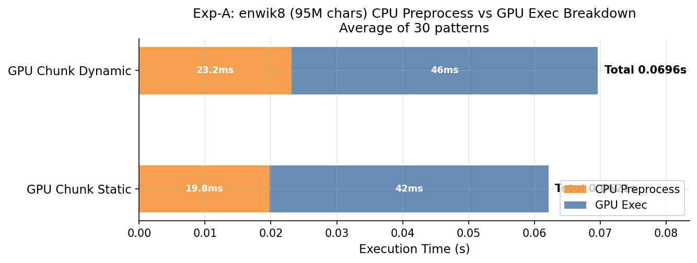

# 実験結果: Dynamic vs Static チャンク分割の性能比較

実験日: 2026-08-07  
ブランチ: `001`  
計測環境: Docker コンテナ（CUDA GPU、`run_all.sh --runs 3` で3回平均を取得）

---

## 1. 実験設定

### 1.1 対象実装

本実験では CPU 版 1 種類と GPU 版 3 種類、合計 4 種類の NFA ベース正規表現マッチング実装を比較する。  
NFA は Thompson の構成法で構築し、部分一致検索（O(L × m)、L: 行長、m: NFA 状態数）を各行に適用する。

| 実装名 | ファイル | 並列単位 | スレッド数 |
|---|---|---|---|
| CPU | `nfa_cpu.c` | シリアル（1スレッド） | 1 |
| **GPU Line** | `src/gpu/line_parallel/nfa_gpu.cu` | **1スレッド = 1行** | n_lines |
| **GPU Chunk Static** | `src/gpu/chunk_parallel/nfa_gpu_chunk.cu` | **1スレッド = LPC 行（固定）** | ⌈n_lines / LPC⌉ |
| **GPU Chunk Dynamic** | `src/gpu/chunk_parallel/nfa_gpu_chunk.cu` | **1スレッド = 文字数が均等になるチャンク** | ⌈n_lines / LPC⌉（目標） |

デフォルト LPC（Lines Per Chunk）= 8。CUDA ブロックサイズ = 256 スレッド。

---

### 1.2 GPU 3 手法の詳細

#### (1) GPU Line（Line-Parallel）

各行を独立した CUDA スレッドで並列処理する最もシンプルな並列化手法。

```
n_threads = n_lines
for each thread tid:
    process line[tid] with NFA
```

- **特徴**: スレッド数が行数に等しく、GPU 並列度を最大化できる
- **弱点**: 行長が不均一な場合、長い行を処理するスレッドがボトルネックになりワープ内でアイドルスレッドが発生する
- **CPU前処理**: 行オフセット計算 O(text_bytes) のみ。チャンク境界計算は不要

#### (2) GPU Chunk Static（固定行数チャンク分割）

テキストを **LPC 行ごとの固定サイズチャンク**に分割し、1 スレッドが 1 チャンクを担当する。

```c
// 前処理コード（nfa_gpu_chunk.cu L121-127）
n_chunks = (n_lines + LINES_PER_CHUNK - 1) / LINES_PER_CHUNK;
for (int c = 0; c < n_chunks; c++) {
    chunk_ls[c] = c * LINES_PER_CHUNK;           // チャンクの開始行
    chunk_le[c] = min((c+1) * LINES_PER_CHUNK, n_lines);  // チャンクの終了行
}
```

- **特徴**: CPU 前処理が O(n_lines / LPC) と軽量
- **弱点**: チャンク内の行長が不均一な場合、スレッド間で処理時間が大きく異なる（ロードインバランス）
- **CPU前処理**: 行分割 O(text_bytes) + 固定チャンク境界計算 O(n_chunks)

#### (3) GPU Chunk Dynamic（文字数ベース動的チャンク分割）

累積文字数が均等になるようにチャンク境界を動的に決定する手法。

```c
// 前処理コード（nfa_gpu_chunk.cu L246-274）
total_chars = sum(h_len[i] for i in range(n_lines));   // 全行スキャン O(n_lines)
n_chunks_target = (n_lines + LPC - 1) / LPC;
target_chars = total_chars / n_chunks_target;          // 1チャンクの目標文字数

// 累積文字数でチャンク境界を決定
running_chars = 0; chunk_start = 0;
for each line i:
    running_chars += h_len[i];
    if running_chars >= target_chars or i == last:
        emit chunk(chunk_start, i+1)
        chunk_start = i+1; running_chars = 0
```

- **特徴**: 各チャンクの総文字数がほぼ均等になり、スレッド間の処理時間が揃う
- **弱点**: CPU 前処理が O(n_lines) のスキャンを必要とする
- **CPU前処理**: 行分割 O(text_bytes) + 文字数累積スキャン O(n_lines) + チャンク境界確定 O(n_lines)

#### 計測時間の定義（ソースコード L98-214 より）

```
cpu_pre_time  = t1 - t0  : 行分割 + チャンク境界計算（Static/Dynamic で内容が異なる）
gpu_exec_time = t2 - t1  : cudaMemcpy H→D + カーネル実行 + cudaDeviceSynchronize + cudaMemcpy D→H
```

> [!NOTE]
> **両手法の cpu_pre_time には行分割処理（O(text_bytes) の memchr ループ）が含まれる。**  
> このため、enwik8（95MB）での Static CPU前処理 19.8ms の大部分は行分割コスト。  
> Dynamic と Static の前処理差（3.4ms）が Dynamic 固有の O(n_lines) スキャンコストに相当する。

---

### 1.3 使用した正規表現パターン

ベンチマークには `data/test_cases.csv` に定義された **30 種類**の正規表現パターンを使用する。  
すべての実験で同一の 30 パターンを適用し、実行時間はその**30 パターンの平均**として報告する。

#### パターン一覧

| # | パターン | 種別 | 特徴 |
|---|---|---|---|
| 1 | `the` | 単純な部分文字列 | 高頻度・短パターン |
| 2 | `(The\|An\|In\|Of)` | 複数選択肢 | 先頭大文字語 |
| 3 | `Wikipedia` | 単純な部分文字列 | 固有名詞 |
| 4 | `a*b` | 量指定子 `*` | NFA 分岐が多い |
| 5 | `go*gle` | 量指定子 `*` | 実用的な誤字パターン |
| 6 | `(one\|two\|three\|four\|five)` | 数詞の選択 | 状態数が増加 |
| 7 | `cat\|dog` | 2択 | シンプルな選択肢 |
| 8 | `http` | URL 接頭辞 | 低頻度マッチ |
| 9 | `.+ing` | 任意文字 + 接尾辞 | ワイルドカード使用 |
| 10 | `a+b*c` | 量指定子の組み合わせ | |
| 11 | `the .+` | 広域ワイルドカード | 多くの行にマッチ |
| 12 | `.+ of .+` | 複合ワイルドカード | |
| 13 | `(19\|20).+` | 世紀パターン | 年代 |
| 14 | `http.+` | URL パターン | 低頻度マッチ |
| 15 | `.+ the .+` | 高頻度ワイルドカード | ほぼ全行にマッチ |
| 16 | `http.+wiki` | URL + 固有名詞 | |
| 17 | `(the\|a\|an) .+` | 冠詞 + ワイルドカード | 高頻度マッチ |
| 18 | `.+er` | 接尾辞 | |
| 19 | `.+ and .+` | 接続詞パターン | |
| 20 | `.+ly` | 副詞接尾辞 | |
| 21 | `(the)` | グループ化 | パターン1の括弧版 |
| 22〜30 | `(the\|and\|for\|...)` | 単語選択肢の漸増 | 2語→10語の段階的拡張 |

> **選択肢が増えるほど NFA の状態数が増加し、1文字あたりの処理コストが上昇する。**  
> これにより、行長の違いが GPU スレッド実行時間の差として顕在化しやすくなる。

---

### 1.4 ベースデータ

**enwik8** (`data/wiki_plain.txt`): Wikipedia テキスト（英語）

| 項目 | 値 |
|---|---|
| ファイルサイズ | 約 96MB |
| 合計文字数 | 95,909,488 文字 |
| 総行数 | 831,543 行 |
| 平均行長 | 115.3 文字 |
| 行長標準偏差 | 406.9 |
| 行長中央値 | 34 文字 |
| 行長 90 パーセンタイル | 312 文字 |

---

## 2. 合成データセットの生成方法

### 2.1 共通事項

すべての合成データセットは `wiki_plain.txt` の実際の行を素材として生成した。  
乱数シード: `SEED = 42`（Python `random.seed(42)`）  
生成スクリプト: `sprints/001/generate_experiment_data.py`

### 2.2 uniform.txt（均一行長データ）

**目的**: 行長が均一な場合の Static ≈ Dynamic を確認する。

**生成手順**:
1. `wiki_plain.txt` から行長が **30 文字以上 60 文字未満**の行をフィルタリング
2. フィルタ後のプールを `random.shuffle` でシャッフル（シード=42）
3. 先頭から順に行を追加し、累積文字数が 10,000,000 文字を超えた時点で終了

**生成結果**:

| 項目 | 値 |
|---|---|
| 行数 | 157,538 行 |
| 合計文字数 | 6,761,094 文字 |
| 平均行長 | 42.9 文字 |
| 行長標準偏差 | 8.6 |
| 最小行長 | 30 文字 |
| 最大行長 | 59 文字 |

### 2.3 varied.txt（交互分散・ばらつき大データ）

**目的**: 行長の分散が大きく、かつ短行と長行が**均等に分散**している場合を検証する。

**生成手順**:
1. `wiki_plain.txt` から短行プール（行長 1〜15 文字）を抽出
2. `wiki_plain.txt` から長行プール（行長 500 文字以上）を抽出
3. 各プールを `random.shuffle`（シード=42）
4. 短行1行・長行1行を**交互に**連結し、累積文字数が 10,000,000 文字を超えた時点で終了

**生成結果**:

| 項目 | 値 |
|---|---|
| 行数 | 25,260 行（短行 12,630 行 + 長行 12,630 行） |
| 合計文字数 | 10,025,841 文字 |
| 平均行長 | 395.9 文字 |
| 行長標準偏差 | 434.1 |
| 最小行長 | 1 文字 |
| 最大行長 | 3,888 文字 |

### 2.4 varied_extreme.txt（交互分散・極端ばらつきデータ）

**目的**: 分散をさらに拡大した場合（SD ≈ 1355）でも Dynamic が有利にならないことを確認する。

**生成手順**:
1. `wiki_plain.txt` から超短行プール（行長 **1〜5 文字**）を抽出
2. `wiki_plain.txt` から超長行プール（行長 **1,000 文字以上**）を抽出
3. 各プールを `random.shuffle`（シード=42）
4. 超短行1行・超長行1行を**交互に**連結し、累積文字数が 10,000,000 文字を超えた時点で終了

**生成結果**:

| 項目 | 値 |
|---|---|
| 行数 | 7,632 行（超短行 3,816 行 + 超長行 3,816 行） |
| 合計文字数 | 10,016,169 文字 |
| 平均行長 | 1,312 文字 |
| 行長標準偏差 | 1,355.5 |
| 最小行長 | 1 文字 |
| 最大行長 | 29,102 文字 |

### 2.5 blocked.txt（連続ブロック型データ）

**目的**: 短行と長行が**空間的に集中**している（ブロック型）場合を検証する。

**生成手順**:
1. `wiki_plain.txt` から短行プール（行長 1〜15 文字）を抽出し `random.shuffle`（シード=42）
2. `wiki_plain.txt` から長行プール（行長 500 文字以上）を抽出し `random.shuffle`（シード=42）
3. **前半ブロック**: 短行を累積 5,000,000 文字になるまで追加
4. **後半ブロック**: 長行を累積 5,000,000 文字になるまで追加
5. 前半ブロック + 後半ブロックを連結して出力

**生成結果**:

| 項目 | 値 |
|---|---|
| 行数 | 196,015 行 |
| 前半（短行ブロック）行数 | 189,593 行 |
| 後半（長行ブロック）行数 | 6,422 行 |
| 合計文字数 | 6,720,710 文字（計測時の実サイズ: 6,916,725 文字） |
| 前半の平均行長 | 9.1 文字 |
| 後半の平均行長 | 778.6 文字 |
| 全体の行長標準偏差 | 146.2 |

> [!NOTE]
> SD=146 は varied（434）や extreme（1355）より**小さい**にもかかわらず Dynamic が最も有利になった。
> これは SD ではなく行長の「ブロック性（空間的局在性）」が決め手であることを示している。

---

## 3. 実験 A: CPU 前処理時間の直接比較（enwik8）

**データ**: `wiki_plain.txt`（95,909,488 文字、3回平均）  
**結果ディレクトリ**: `results/run_20260807_09_30_15/`

| 手法 | CPU前処理(ms) | GPU実行(ms) | 合計(ms) | Dyn/Sta比 |
|---|---|---|---|---|
| GPU Line | 21.94 | 40.39 | 63.99 | — |
| GPU Chunk Static | 19.84 | 42.29 | 63.54 | 1.000 |
| **GPU Chunk Dynamic** | **23.16** | **46.48** | **71.43** | **1.124x（Dynamic が遅い）** |

### 内訳分析

- **CPU前処理**: Dynamic は Static より **+3.3ms**（23.2ms vs 19.8ms、1.17倍）
- **GPU実行**: Dynamic は Static より **+4.2ms**（46.5ms vs 42.3ms、1.10倍）
- **総合**: CPU前処理・GPU実行の両方で Dynamic が遅く、合計で **12.4% 遅い**

> [!NOTE]
> CPU前処理の差（3.3ms）は全体の 5%、GPU実行の差（4.2ms）は全体の 7%。
> 両方の要因が積み重なって Dynamic が遅くなっている。
> enwik8 では「Dynamic の GPU 実行が Static より速い」という効果は観測されなかった。

**図: enwik8 CPU前処理 vs GPU実行 内訳（3回平均）**



---

## 4. 実験 B: データセット別の性能比較（3回平均）

すべての値は 3 回計測の平均（`avg.csv` の最大サイズ行）。  
括弧内は合計文字数（ = 各データセットの最大計測サイズ）。

### 4.1 全手法×全データセット 比較表

| データセット | 合計文字数 | GPU Line (ms) | Chunk Static (ms) | Chunk Dynamic (ms) | Dyn/Sta比 |
|---|---|---|---|---|---|
| enwik8 | 95,909,488 | 63.99 | 63.54 | 71.43 | 1.124x |
| uniform.txt | 6,761,094 | 11.28 | 11.11 | 11.74 | 1.057x |
| varied.txt | 10,025,841 | 11.32 | 14.33 | 16.65 | 1.162x |
| varied_extreme.txt | 10,016,169 | 11.29 | 16.60 | 18.78 | 1.131x |
| blocked.txt | 6,916,725 | 12.89 | 19.15 | 12.97 | **0.677x** |

> [!IMPORTANT]
> blocked.txt でのみ Dynamic が Static を上回る（Dyn/Sta = 0.677x、**32% 高速**）。
> 他の 4 データセットではすべて Static が有利。

**図: 全手法×全データセット 合計実行時間**


**図: Dynamic/Static 比率 と CPU前処理コスト**


### 4.2 CPU前処理・GPU実行 内訳

| データセット | Static pre (ms) | Static gpu (ms) | Dyn pre (ms) | Dyn gpu (ms) |
|---|---|---|---|---|
| enwik8 | 19.84 | 42.29 | 23.16 | 46.48 |
| uniform.txt | 1.44 | 9.66 | 1.54 | 10.19 |
| varied.txt | 0.38 | 13.93 | 0.40 | 16.24 |
| varied_extreme.txt | 0.32 | 16.25 | 0.33 | 18.42 |
| blocked.txt | 1.22 | 17.91 | 1.38 | 11.57 |

**図: CPU前処理 vs GPU実行 内訳（Static / Dynamic 比較）**


### 4.3 考察

#### B-1: uniform.txt（SD=8.6）

- Dyn/Sta = **1.057x**（Static がわずかに速い）
- 行長が均一（30〜59文字）なため、Static の連続行割り当てでも各チャンクの文字数がほぼ均等
- Dynamic の文字数均等化が追加の恩恵をもたらさず、CPU前処理コスト分だけ遅くなる

#### B-2: varied.txt（SD=434、交互分散）

- Dyn/Sta = **1.162x**（Static が速い）
- 短行と長行が**交互**に配置されているため、LPC=8 の Static チャンクには短行4行+長行4行が均等に入る
- Dynamic の文字数均等化のメリットが出ず、前処理コスト分だけ遅い

#### B-3: varied_extreme.txt（SD=1355、交互分散）

- Dyn/Sta = **1.131x**（Static が速い）
- SD が varied の3倍以上でも Dynamic が有利にならない
- 原因: 短行と長行の**交互配置**が保たれており、Static でも自然に均等化される

#### B-4: blocked.txt（SD=146、ブロック型）

- Dyn/Sta = **0.677x**（Dynamic が 32% 速い）
- 前半 189K 行が短行（平均 9.1文字）、後半 6K 行が長行（平均 779文字）
- Static チャンク: 前半チャンク ≈ 73 chars、後半チャンク ≈ 6,229 chars → **85倍の不均衡**
- Dynamic: 文字数均等化により全チャンク ≈ 274 chars → GPU 効率が大幅に向上

**核心的知見**: Dynamic の有利性は SD（標準偏差）ではなく、**行長の空間的局在性（ブロック性）**が決め手。

---

## 5. 実験 C: LPC 値を変えた Dynamic の挙動

**データ**: `varied.txt`（10,025,841 文字）  
**注意**: LPC スイープは単回計測（`summary.csv`）のため、上記3回平均と値が異なる

| LPC | Static (ms) | Dynamic (ms) | Dyn/Sta比 | Static pre (ms) | Dynamic pre (ms) |
|---|---|---|---|---|---|
| 1 | 48.130 | 68.226 | 1.418x | 0.010 | 20.046 |
| 2 | 31.026 | 49.694 | 1.601x | 0.010 | 20.091 |
| **4** | **24.133** | **22.783** | **0.944x ✅** | 0.010 | 19.899 |
| 8 | 18.942 | 25.437 | 1.343x | 0.010 | 20.060 |
| 16 | 16.225 | 23.234 | 1.432x | 0.010 | 19.975 |
| 32 | 14.913 | 20.949 | 1.405x | 0.010 | 19.953 |

### 考察

- Dynamic の CPU前処理は全 LPC で **≈ 20ms（一定）**: LPC に関係なく O(n_lines) スキャンのコストは同じ
- Static は LPC が大きいほど高速（スレッド数減少 → スケジューリングコスト低下）
- **LPC=4 のときのみ** Dynamic が Static を上回る（Dyn/Sta = 0.944x）
- LPC が大きくなると Static の GPU 実行が速くなり、Dynamic の前処理コストが相対的に増大

---

## 6. 全データセット最終まとめ

| データセット | 行長分布パターン | SD | 行数 | Dyn/Sta比 | Dynamic 有利? |
|---|---|---|---|---|---|
| enwik8 | 自然分布（均一寄り） | 407 | 831K | 1.124x | ✗ |
| uniform.txt | 均一（30〜59文字） | 8.6 | 157K | 1.057x | ✗ |
| varied.txt | 短/長 **交互**分散 | 434 | 25K | 1.162x | ✗ |
| varied_extreme.txt | 超短/超長 **交互**分散 | 1355 | 7.6K | 1.131x | ✗ |
| **blocked.txt** | **短/長 ブロック連続** | **146** | **196K** | **0.677x** | **✓** |

**図: 行数 vs Dyn/Sta 比率（散布図）**


> [!NOTE]
> Blocked（196K行）は y < 1.0（Dynamic 有利ゾーン）に位置し、他の4点（y > 1.0）と明確に分離している。
> 行数や SD ではなく「行長のブロック性」が決め手であることが視覚的に示されている。

---

## 7. 総合考察

### 7.1 仮説の検証結果

当初の仮説「行長のばらつき（SD）が大きいほど Dynamic が有利になる」は **否定** された。

| 仮説 | 結果 |
|---|---|
| Dynamic の遅さは CPU前処理の O(n_lines) スキャンに起因する | **部分的に支持**: enwik8 で CPU前処理差=3.3ms 確認。ただし GPU実行の差も同程度存在 |
| 行長均一 → Dynamic の恩恵なし | **支持**: uniform で Dyn/Sta=1.057x |
| SD が大きければ Dynamic が有利 | **否定**: varied（SD=434）、extreme（SD=1355）ともに Dynamic が遅い |
| 行長のブロック性 → Dynamic が有利 | **支持**: blocked で Dyn/Sta=0.677x（+32%） |

### 7.2 enwik8 での Dynamic が遅い理由

1. **行長分布の性質**: enwik8 は中央値 34 文字と均一寄りで、Static の行数ベース分割でも各チャンクの文字数が自然に均等化される
2. **CPU前処理コスト**: 831K行 × 文字数スキャン → 23.2ms が毎回発生
3. **GPU実行も遅い**: Dynamic のチャンク分割が enwik8 では Static より均等でなく、GPU実行も 1.10 倍遅い

### 7.3 Dynamic が有効な条件（実用場面）

| 条件 | 具体例 |
|---|---|
| ファイル前半: 短行のみ / 後半: 長行のみ | ログファイル（ヘッダー + 本文）|
| コメント行（短）が連続した後に本文（長）が連続 | ソースコード |
| 見出し・リスト（短）と本文段落（長）が分離 | Markdown / HTML |

### 7.4 改善の方向性

1. **GPU-side preprocessing**: prefix sum を GPU 上で実行し CPU 前処理を O(log n) に短縮
2. **前処理結果のキャッシュ**: 同一テキストで複数パターンを処理する場合、チャンク境界を一度だけ計算して再利用
3. **アダプティブ切り替え**: 行長の局所性スコアを事前計測し、ブロック性が高い場合のみ Dynamic を選択

---

## 8. 再現方法

```bash
# 環境構築
task env:build
task env:start   # Docker コンテナに入る

# ベースデータ準備
# data/wiki_plain.txt が必要（enwik8 から変換済み）

# 合成データ生成
python3 sprints/001/generate_experiment_data.py        # uniform.txt, varied.txt
# varied_extreme.txt, blocked.txt は手動生成（experiment.md 参照）

# 各実験を 3 回平均で実行
bash run_all.sh data/wiki_plain.txt --runs 3           # 実験 A
bash run_all.sh data/experiment/uniform.txt --runs 3   # 実験 B-1
bash run_all.sh data/experiment/varied.txt --runs 3    # 実験 B-2
bash run_all.sh data/experiment/varied_extreme.txt --runs 3  # 実験 B-3
bash run_all.sh data/experiment/blocked.txt --runs 3   # 実験 B-4 (Blocked)

# LPC スイープ（単回計測）
bash run_lpc_sweep.sh data/experiment/varied.txt \
  --out results/sprint001_lpc_varied --lpc 1 2 4 8 16 32

# グラフ再生成
python3 sprints/001/plot_results.py
```

グラフは `sprints/001/figures/` に保存される。
